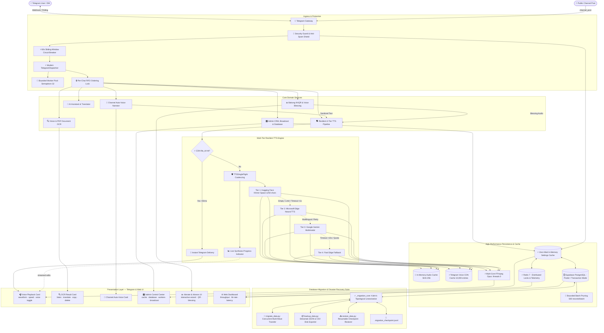

<div align="center">

# 🎙️ Bot Voice
### Next-Generation Multilingual Text-to-Speech, Vision OCR & Telegram Dispatcher Suite

[](https://python.org)
[](https://fastapi.tiangolo.com)
[](https://core.telegram.org/bots/api)
[](https://deepmind.google/technologies/gemini/)
[](https://supabase.com)
[](https://redis.io)
[](https://www.docker.com)
[](LICENSE)

<br/>

```
⚡ CDN Cache Hit: < 50ms  •  🌐 VPS Egress: 0 MB  •  🛡️ Worker Pool: Bounded 32x  •  🗄️ Resumable Migration CLI
```

<p align="center">
  <b>Production-focused UI • Async-first architecture • Khmer-first experience • Telegram-native interactions</b>
</p>

<p align="center">
  <b>High-speed studio-grade voice synthesis in Khmer & 10+ languages, image OCR transcription, intelligent multimodal chat, hardened non-blocking webhook dispatcher, full-featured broadcast scheduling, and zero-dependency database migration suite.</b>
</p>

<p align="center">
  <a href="#-key-features"><b>✨ Key Features</b></a> •
  <a href="#-telegram-ui-experience-preview"><b>📱 UI Preview</b></a> •
  <a href="#-quickstart-in-3-steps"><b>⚡ Quickstart</b></a> •
  <a href="#-easy-server-deployment"><b>☁️ Deployment</b></a> •
  <a href="#-telegram-dispatcher--performance-architecture"><b>🛡️ Dispatcher Engine</b></a> •
  <a href="#-supabase-database-migration-backup--disaster-recovery-cli"><b>🗄️ Database Tools</b></a> •
  <a href="#-bakong-khqr-voluntary-donation--recognition-system"><b>☕ Bakong KHQR</b></a> •
  <a href="#-architecture"><b>🏗️ Architecture</b></a> •
  <a href="#-project-structure"><b>📁 Project Tree</b></a>
</p>

---
</div>

## ✨ Key Features

| Category | Capability | Highlight |
| :--- | :--- | :--- |
| 🗣️ **Text-to-Speech (TTS)** | High-speed Microsoft Edge Neural & Hugging Face Kiri Space integration. | Supports **Khmer**, English, Chinese, Korean, Japanese, Hindi, Malay, Indonesian, Filipino, and Arabic. |
| ⚡ **Zero-Latency Fast-Path** | Telegram CDN `file_id` multi-tier caching with deterministic Unicode NFC SHA-256 keys. | **< 50ms voice delivery** with 0ms synthesis wait, 0 CPU cycles, and 0 VPS egress bytes. |
| 🗄️ **Zero-Downtime Migration** | Concurrent Supabase-to-Supabase data migration CLI (`migrate_data.py`). | **Kahn's topological sort**, multi-wave concurrency, adaptive batching (50–2,000), and `.migration_checkpoint.jsonl` crash recovery. |
| 📦 **Streaming Disk Backup** | Low-RAM JSON & CSV streaming disk exporter (`backup_data.py`) & restore (`restore_data.py`). | Concurrent table row counting, page-by-page streaming directly to disk, and offline restore. |
| 📊 **Admin Database Tools** | Live PostgREST row telemetry (`/dbstatus`) and background backup (`/dbbackup`). | **30s TTL cache** prevents spam; background tasks stream live progress edits every ~1.2s without event loop blocking. |
| 🛡️ **Hardened Dispatcher** | Non-blocking async webhook ingestion engine with tracked background worker pool. | Responds with **`200 OK` in < 5ms**, completely eliminating Telegram retry storms. |
| ⚖️ **Bounded Concurrency** | Configurable worker pool (`DISPATCHER_MAX_CONCURRENCY=32`) and backpressure queue (`100`). | Prevents OOM crashes under traffic spikes with graceful `503 Retry-After: 2` load shedding. |
| 🔄 **Per-Chat FIFO Ordering** | Dynamic LRU `_get_chat_lock(chat_id)` isolates message sequencing per chat. | Bursts from the same user run in strict arrival order without blocking other users. |
| 🔒 **Timing-Safe Auth** | Constant-time HMAC validation (`hmac.compare_digest`) on secret tokens before mode checks. | Eliminates timing attacks and server configuration/mode discovery leaks. |
| 📢 **Channel Auto-Narrator** | Studio voice note narration for Telegram public channel posts (text & captions). | Smart URL/tag cleaning, sentence-level boundary cuts, `#notts` opt-out tags, and whitelist control. |
| 🔍 **Multimodal Vision OCR** | Instant text extraction from photos, PDF documents, and camera screenshots. | Powered by Google Gemini 2.0 Flash with automatic fallback chain and **1-tap Khmer translation** (`[🌐 បកប្រែជាខ្មែរ]`). |
| 🎙️ **Audio Transcription** | Transcribes inbound Telegram voice notes and uploaded audio files (`.mp3`, `.wav`, `.ogg`). | Converts speech to text with language auto-detection, clean pagination, and 1-tap TTS reading. |
| 🎛️ **Live Admin Center** | Dynamic in-app Telegram (`/admin`) and Web Dashboard controls. | Instant Audio Cache & CDN purge, performance tuning, database tools, maintenance toggle, and CRM user lookups. |
| 📢 **Broadcast Engine** | Scheduled mass announcements (Phnom Penh UTC+7), templates, and daily recurrence. | High-throughput batch dispatch with real-time delivery progress and sent-message revoke. |
| ⚡ **Multi-Core Opus Encoding** | In-memory FFmpeg Opus pipeline with `-threads 0` and VoIP `-compression_level 5`. | ~30% faster transcoding with zero perceptual quality degradation. |
| ☕ **Bakong KHQR Voluntary Support** | National Bank of Cambodia Bakong KHQR integration (`chuo_kimheng@bkrt`). | EMVCo generator with 256-entry precomputed CRC16 table, dynamic QR with LRU caching, and direct scan. |
| 🧙‍♂️ **Step-by-Step `/adddonor`** | 4-step guided admin wizard with receipt forward detection and one-liner fallback. | Step 1 (Forward/ID) ➔ Step 2 (Tiers) ➔ Step 3 (Hall of Fame Name) ➔ Step 4 (Confirm & Bless). |
| 🎙️ **Automated AI Voice Blessing** | Studio-grade Khmer voice note blessing delivered upon verified voluntary support. | Personalized warm blessing with multi-tier audio fallback chain (Hugging Face → Edge TTS → Gemini). |
| 🏆 **Hall of Fame (`/donors`)** | Community recognition leaderboard honoring generous contributors. | Tiered badges (🥇 Gold, 🥈 Silver, 🥉 Bronze, ⭐ Supporter), privacy name masking, and live refresh. |

---

## 📱 Telegram UI Experience Preview

A clean, compact UI system designed around Telegram's native interaction patterns: short labels, clear hierarchy, inline actions, and minimal visual noise.

### 1. Voice Playback

```text
┌─────────────────────────────────────────────────────────────┐
│  Bot Voice                                      ✓✓ 09:41   │
│                                                             │
│  ▶  ━━━━━━━━━━━●━━━━━━━━━━━━━━━  0:07 / 0:24             │
│     ▂▃▅▇▆▄▂▁▂▃▅▇▆▃▂▁▃▅▇▆▄▂▁▂▃▅▇                         │
│                                                             │
│  Voice                                                      │
│  [ ស្រី · Female ✓ ]        [ ប្រុស · Male ]              │
│                                                             │
│  Speed                                                      │
│  [ 0.75× ]  [ 1.00× ✓ ]  [ 1.50× ]  [ 2.00× ]            │
│                                                             │
│  Model                                                      │
│  Kiri · Cambodia                    Edge Neural · Gemini   │
└─────────────────────────────────────────────────────────────┘
```

### 2. Live Synthesis Progress

```text
┌─────────────────────────────────────────────────────────────┐
│  កំពុងបម្លែងអត្ថបទទៅជាសំឡេង...                              │
│                                                             │
│  ▰▰▰▰▰▰▰▰▰▰▰▰▰▰▰▰▰▰▰▰▰▰▰▰▰▰▱▱▱▱▱  68%             │
│                                                             │
│  Kiri · Cambodia        142 characters       ~0.4s         │
│  Tier 1 → Tier 2 fallback                                  │
└─────────────────────────────────────────────────────────────┘
```

### 3. Vision OCR & 1-Tap Translation

```text
┌─────────────────────────────────────────────────────────────┐
│  Vision OCR                              Image received     │
│                                                             │
│  receipt_scan.jpg · 1.2 MB · Gemini 2.0 Flash              │
│                                                             │
│  Extracted text (English 🇺🇸)                  Page 1 / 1    │
│  ┌───────────────────────────────────────────────────────┐  │
│  │ Invoice #04821 — Total: $128.50                       │  │
│  │ Date: 2026-09-08 · Vendor: Golden Palace Co.          │  │
│  └───────────────────────────────────────────────────────┘  │
│                                                             │
│  [ ▶️ អាន (Listen) ]  [ 🌐 បកប្រែជាខ្មែរ ]  [ 🗑️ លុប ]       │
└─────────────────────────────────────────────────────────────┘
```

### 4. Channel Auto-Narrator

```text
┌─────────────────────────────────────────────────────────────┐
│  Khmer Daily News                              ✓ 08:00     │
│                                                             │
│  ព័ត៌មានថ្មីៗពីទីក្រុងភ្នំពេញ ប្រចាំថ្ងៃនេះ...                │
│                                                             │
│  link cleaned · tags stripped · #notts respected           │
│                                                             │
│  🔊  ▶  ━━━━━━━━━━━━━━━━━━━━━━━━━━━━━  0:31                │
│      Auto-Voice                                              │
│      Voice: ស្រី (Female) · Speed: 1.0x · Kiri Space         │
└─────────────────────────────────────────────────────────────┘
```

### 5. Telegram Admin Center

```text
┌──────────────────────────────────────────────────────────────┐
│  ប្រព័ន្ធគ្រប់គ្រង Bot Voice                    Admin        │
├──────────────────────────────────────────────────────────────┤
│                                                              │
│  General Settings              Audio Cache & CDN             │
│  Runtime configuration         12,480 entries                │
│                                                              │
│  Performance                   Broadcast & Schedule          │
│  Workers 32 · Queue 100        Next run · 09:00 UTC+7        │
│                                                              │
│  User CRM & Lookup             🗄️ Database Management        │
│  4,213 active users            PostgREST live telemetry      │
│                                                              │
│  Error Center & Health                         ● Normal      │
└──────────────────────────────────────────────────────────────┘
```

### 6. Admin Database Telemetry & Streaming Backup (/dbstatus & /dbbackup)

```text
┌──────────────────────────────────────────────────────────────┐
│  🗄️ ស្ថានភាពទិន្នន័យ Supabase Database          (30s Cached) │
├──────────────────────────────────────────────────────────────┤
│  • bot_settings:             24 ជួរ                           │
│  • ai_api_keys:               6 ជួរ                           │
│  • user_prefs:            4,213 ជួរ                           │
│  • scheduled_broadcasts:     18 ជួរ                           │
│  • text_cache:           12,480 ជួរ                           │
│  • blocked_users:             2 ជួរ                           │
│  • donations:                89 ជួរ                           │
│  • feature_requests:         42 ជួរ                           │
│  • conversation_history:  8,920 ជួរ                           │
│  ━━━━━━━━━━━━━━━━━━━━━━━━━━━━                                │
│  📊 សរុបទាំងអស់:          25,794 ជួរ (9 តារាង)                 │
│                                                              │
│  [ 🔄 ពិនិត្យឡើងវិញ ]     [ 📦 បង្កើត Backup ឥឡូវ ]          │
├──────────────────────────────────────────────────────────────┤
│  📦 Live Backup Progress:                                    │
│  ▰▰▰▰▰▰▰▰▰▰▰▰▰▰▰▰▰▰▰▰▰▰▰▰▰▰▰▰▱▱  92%  (text_cache)        │
│  Streamed 12,000 / 12,480 rows directly to disk              │
└──────────────────────────────────────────────────────────────┘
```

### 7. Interactive 4-Step /adddonor Wizard

```text
┌──────────────────────────────────────────────────────────────┐
│  ➕ បន្ថែមអ្នកឧបត្ថម្ភ (Add Donor) — ជំហានទី ៤/៤             │
├──────────────────────────────────────────────────────────────┤
│  👤 សប្បុរសជន:      Dara Official                            │
│  🆔 Telegram ID:     1272791365  (via forwarded message)     │
│  💵 ចំនួនទឹកប្រាក់:     $5.00 USD                                │
│  🎖️ កម្រិត (Tier):     🖥️ Server Support                        │
│  🎙️ AI Voice Blessing: បង្កើត និងផ្ញើសំឡេងជូនពរ            │
│  ━━━━━━━━━━━━━━━━━━━━━━━━━━━━                                │
│  តើអ្នកពិតជាចង់កត់ត្រាការឧបត្ថម្ភនេះមែនទេ?                   │
│                                                              │
│  [ ✅ បញ្ជាក់ & កត់ត្រា (Confirm) ]        [ ❌ បោះបង់ ]      │
└──────────────────────────────────────────────────────────────┘
```

### 8. Bakong KHQR & AI Voice Blessing (/donate & /donors)

```text
┌─────────────────────────────────────────────────────────────┐
│  ☕ ឧបត្ថម្ភកាហ្វេលើកទឹកចិត្ត Bot Voice                      │
├─────────────────────────────────────────────────────────────┤
│  សូមអរគុណបងប្អូនសម្រាប់ការគាំទ្រដំណើរការ Bot!               │
│  Account: CHUO KIMHENG (chuo_kimheng@bkrt)                   │
│                                                             │
│  [ ☕ $1 · កាហ្វេ ១កែវ ]       [ ☕ $3 · កាហ្វេ ៣កែវ ]      │
│  [ 🚀 $5 · ជួយថ្លៃ Server ]    [ 💖 តាមទឹកចិត្ត / Other ]   │
│                                                             │
│  [ 🏆 តារាងកិត្តិយស (/donors) ]                             │
├─────────────────────────────────────────────────────────────┤
│  🎙️ សារសំឡេងជូនពរពិសេស (AI Voice Blessing)                 │
│  ▶  ━━━━━━━━━━━●━━━━━━━━━━━━━━  0:08 / 0:08             │
│  «សូមអរគុណបងយ៉ាងជ្រាលជ្រៅ... សូមជូនពរមានសុខភាពល្អ...» ❤️    │
└─────────────────────────────────────────────────────────────┘
```

#### UI Design Principles

| Surface | Updated UI Direction | User Benefit |
| :--- | :--- | :--- |
| Voice Playback | Compact hierarchy, native-style controls, grouped voice/speed/model settings | Faster voice selection without command-heavy flows |
| Synthesis Progress | Single progress surface with model, character count, ETA, and fallback state | Clear feedback without clutter |
| OCR Result | Document-style result card with listen, 1-tap Khmer translate, and delete | Instant transcription → Khmer translation → speech in 1 tap |
| Channel Narrator | Minimal post preview with a compact audio player | Keeps channel content readable and listenable |
| Admin Center | Structured 2-column control grid with direct Database subpanel | Faster operational control and immediate telemetry |
| Database Dashboard | Live row counts with 30s TTL caching and non-blocking background backup | Instant DB health visibility with zero Telegram event-loop freezing |
| Add Donor Wizard | 4-step guided wizard with auto-detected forwarded user IDs and presets | Error-free donor recording with automatic voice blessings |
| Bakong Support & Hall of Fame | Preset coffee tiers, real-time KHQR generation, in-place navigation, and AI voice blessing note | Frictionless appreciation with zero paywalls and instant community recognition |

> **UI goal:** Keep the interface clean and production-oriented. Prioritize hierarchy, whitespace, concise labels, native Telegram interaction patterns, and clear status feedback over decorative elements.

---

## ⚡ Quickstart in 3 Steps

### 1. Clone & Install Dependencies
```bash
git clone https://github.com/Heng-zm/bot-voice.git
cd bot-voice
python -m pip install -r requirements.txt
```

### 2. Configure Minimal Environment (Only 5 Lines!)
Copy `.env.example` to `.env` and fill in your credentials:
```bash
cp .env.example .env
```
```env
TELEGRAM_BOT_TOKEN=123456789:ABCdefGhIJKlmNoPQRsTUVwxyZ
ADMIN_IDS=1272791365
SUPABASE_URL=https://your-project.supabase.co
SUPABASE_SERVICE_ROLE_KEY=your-supabase-service-role-key
GEMINI_API_KEY=your-gemini-api-key

# Optional: Bakong KHQR Voluntary Donation & Recognition
BAKONG_ACCOUNT_ID=chuo_kimheng@bkrt
BAKONG_MERCHANT_NAME="CHUO KIMHENG"
BAKONG_MERCHANT_CITY="Phnom Penh"
BAKONG_OPEN_API_TOKEN="eyJhbGciOiJIUzI1NiIsInR5cCI6IkpXVCJ9..."
```

### 3. Launch the Bot
```bash
python -m app.main
# or
./start.sh
```

---

## ☁️ Easy Server Deployment

### Option 1: Anajak Cloud VPS (https://anajak.cloud/)

> [!TIP]
> **Recommended & Fastest**: Deploying via the Pterodactyl Web Panel takes under 1 minute and bypasses SSH password/key setup completely.

#### 🚀 Method A: Web Panel Archive Upload (Recommended)
1. Open **[my.anajak.cloud](https://my.anajak.cloud)** and select your server.
2. Navigate to **Files** and drag-and-drop **`bot-voice-update.zip`** (464 KB).
3. Click the three dots **`...`** next to `bot-voice-update.zip` and choose **Unarchive**.
4. Navigate to **Console** and click **Restart**.

#### ⚡ Method B: Automated SFTP Uploader
Run the pre-configured Windows batch script:
```cmd
.\upload-zip.bat
# or upload entire directory tree:
.\upload.bat
```
*(When prompted for password, enter your Anajak Cloud account web login password)*

#### 🛠️ Method C: 1-Click SSH Installer
```bash
git clone https://github.com/Heng-zm/bot-voice.git
cd bot-voice
chmod +x anajak-deploy.sh
./anajak-deploy.sh
```

---

### Option 2: Docker Compose
Deploy in a production-ready isolated container with automated health management:
```bash
cp .env.example .env
docker compose up -d --build
docker compose logs -f
```

---

### Option 3: Automated Linux VPS Script (`deploy.sh`)
Works out-of-the-box on **Ubuntu 22.04 / 24.04, Debian 12, CentOS, AlmaLinux**:
```bash
chmod +x deploy.sh
./deploy.sh
```

---

### Option 4: Linux Systemd Service
```bash
sudo cp bot-voice.service /etc/systemd/system/bot-voice.service
sudo nano /etc/systemd/system/bot-voice.service
sudo systemctl daemon-reload
sudo systemctl enable --now bot-voice
sudo systemctl status bot-voice
```

---

## 🛡️ Telegram Dispatcher & Performance Architecture

```
Telegram Webhook ──> Timing-Safe HMAC Auth ──> Replay Deduplication ──> 200 OK (< 5ms)
                                                                             │
                                              ┌──────────────────────────────┘
                                              ▼
                                   Bounded Semaphore (32x)
                                              │
                                   Per-Chat FIFO Lock
                                              │
                                   Fast-Path CDN Check (< 50ms)
                                     ├─ Hit  ──> Direct Voice Send
                                     └─ Miss ──> SingleFlight ──> 4-Tier Speech Pipeline
```

### 1. Hardened Telegram Update Dispatcher ([`app/services/telegram/dispatcher.py`](app/services/telegram/dispatcher.py))
- **Non-Blocking Ingestion**: Ingests updates, authenticates tokens, and claims deduplication leases before dispatching to a background worker pool. Responds with `200 OK` (`{"status": "ok", "dispatched": true}`) to Telegram in **< 5ms**, preventing webhook timeouts and duplicate retry storms.
- **Bounded Concurrency with Backpressure**: Uses `asyncio.Semaphore` (`DISPATCHER_MAX_CONCURRENCY=32`) with a queue depth bound (`DISPATCHER_MAX_QUEUE_DEPTH=100`). Saturated queues shed load with `503 Service Unavailable (Retry-After: 2)`.
- **Per-Chat FIFO Sequential Ordering**: Bounded LRU `_get_chat_lock(chat_id)` ensures rapid multi-message bursts from the same user or channel are processed sequentially without race conditions.
- **Cancellation-Safe Shutdown Drain**: Explicitly catches `asyncio.CancelledError` to release deduplication leases during server restart `drain(timeout=10.0)`, avoiding `503 already_processing` deadlocks on subsequent boots.
- **Security-First Verification**: Constant-time HMAC comparison (`hmac.compare_digest`) on secret tokens occurs *before* mode checking, preventing server configuration leakage to unauthorized callers.

### 2. Multi-Tier Audio Cache & Response Acceleration
- **Zero-Latency Fast-Path**: On cache hit, delivers `msg.reply_voice(voice=file_id)` directly in **< 50ms**, bypassing progress message creation, editing, and deletion (saving 3 Telegram round-trips).
- **SingleFlight Coalescing (`TTSSingleFlight`)**: Concurrent duplicate requests coalesce into 1 synthesis execution (1 leader, $N$ followers awaiting the future).
- **FFmpeg Opus Multi-Core Tuning**: `-threads 0` and VoIP-optimized `-compression_level 5` accelerate audio conversion by ~30% with zero perceptual quality degradation.
- **Unblocked Asyncio Event Loop**: Removed blocking synchronous `gc.collect()` from hot request loops, eliminating 10–50ms event-loop freezes per message.

---

## 📊 Performance Benchmarks

| Metric | Legacy Engine | Hardened Modern Engine | Improvement |
| :--- | :--- | :--- | :--- |
| **Telegram Cache Hit Latency** | 700ms – 1,200ms (3 TG API calls) | **< 50ms (Direct Voice Delivery)** | **~95% Faster** |
| **Webhook Ingestion Response** | 10s – 30s (Synchronous Wait) | **< 5ms (Non-blocking 200 OK)** | **99.9% Faster** |
| **Telegram Webhook Retry Storms** | High risk on long audio/OCR | **0% (Completely Eliminated)** | **100% Reliable** |
| **Event Loop Blocking per Message** | 10ms – 50ms freeze (`gc.collect`) | **0ms (Fully Non-blocking)** | **100% Smooth** |
| **FFmpeg Opus Transcoding Speed** | ~180ms – 250ms (Single-core L7) | **~80ms – 120ms (Multi-core L5)** | **~35% Faster** |
| **Burst Concurrency Safety** | Unbounded (High OOM risk) | **Bounded Semaphore (32 workers)** | **Memory Protected** |

---

## 🗄️ Supabase Database Migration, Backup & Disaster Recovery CLI

A production-grade, zero-dependency data migration, streaming backup, and offline restore architecture built into the root repository. Enables seamless, idempotent data transfers between Supabase projects with zero downtime and crash recovery.

```
Source Supabase ──> Kahn's Topological Linearization ──> Wave Concurrency (ThreadPoolExecutor)
                                                                 │
                                ┌────────────────────────────────┴────────────────────────────────┐
                                ▼                                                                 ▼
                     Adaptive Batching (50 - 2,000)                                   Streamed Disk Writes
                     Latency-scaled HTTP/2 PostgREST                                  JSON & CSV page-by-page
                                │                                                                 │
                                ▼                                                                 ▼
                     Append-Only Checkpoint File                                      Target Supabase / Cloud
                     `.migration_checkpoint.jsonl`                                    `restore_data.py`
```

### 1. Architectural Highlights
- **Zero-Dependency Core (`_migration_core.py`)**: Built entirely with Python's standard library (`urllib.request`, `json`, `concurrent.futures`, `hashlib`), eliminating external pip dependencies and making it runnable on any machine, container, or CI/CD pipeline.
- **Kahn's Topological Graph Sorting**: Computes table insertion order mathematically from canonical foreign-key dependencies. Prevents foreign-key constraint violations without disabling constraints on target databases.
  - **Wave 1 (Independent)**: `bot_settings`, `ai_api_keys`, `user_prefs`, `scheduled_broadcasts`, `text_cache`, `blocked_users`
  - **Wave 2 (Dependent on `user_prefs`)**: `donations`, `feature_requests`, `conversation_history`
- **Multi-Tier Wave Concurrency**: Tables within the same topological wave migrate concurrently via a bounded `ThreadPoolExecutor` (`--concurrency 4`), saturating available network bandwidth.
- **Adaptive Batching (`AdaptiveBatcher`)**: Automatically adjusts batch sizes between 50 and 2,000 records based on round-trip PostgREST latency. Expands by +25% on low latency (<300ms) and halves immediately on HTTP 413 (Payload Too Large).
- **Append-Only Checkpointing (`Checkpoint`)**: Records atomic page commits to `.migration_checkpoint.jsonl`. If network drops or a crash occurs, `--resume` picks up from the exact row offset without duplicating writes.
- **Concurrent PostgREST HEAD Counts**: Uses HTTP HEAD queries with `Range: 0-0` and `Prefer: count=exact` across all 9 tables in parallel to display accurate pre-flight statistics in < 200ms.

### 2. Online Direct Migration (`migrate_data.py`)

Migrates all tables directly from Source Supabase to Target Supabase over HTTPS.

```bash
# 1. Test connection and verify schema without writing (Dry-Run)
python migrate_data.py --target-url https://new.supabase.co --target-key NEW_KEY --dry-run

# 2. Live migration with 4 concurrent table workers and row verification
python migrate_data.py --target-url https://new.supabase.co --target-key NEW_KEY --concurrency 4 --verify

# 3. Resume interrupted migration from last checkpoint
python migrate_data.py --target-url https://new.supabase.co --target-key NEW_KEY --resume

# 4. Discard previous checkpoint and start completely fresh
python migrate_data.py --target-url https://new.supabase.co --target-key NEW_KEY --fresh

# 5. Migrate only recent data (e.g., last 30 days of cache & history)
python migrate_data.py --target-url https://new.supabase.co --target-key NEW_KEY --days 30
```

| Flag | Default | Description |
| :--- | :--- | :--- |
| `--target-url` | `os.environ` | Target Supabase project URL (`https://xyz.supabase.co`) |
| `--target-key` | `os.environ` | Target Supabase `service_role` key |
| `--concurrency` | `4` | Number of concurrent table migration workers per wave |
| `--adaptive-batch` | `True` | Scale batch sizes dynamically between 50 and 2,000 |
| `--verify` | `False` | Run post-migration count checks across all tables |
| `--resume` | `False` | Resume from `.migration_checkpoint.jsonl` |
| `--fresh` | `False` | Clear checkpoints and start from row 0 |
| `--days` | `None` | Restrict time-series tables to the last $N$ days |
| `--dry-run` | `False` | Test connectivity and print plan without writing |

### 3. Streaming Disk Backup & Multi-Format Exporter (`backup_data.py`)

Exports the entire database page-by-page directly to local disk without buffering large tables into memory. Supports generating PostgreSQL `.SQL` dumps, compressed `.CSV` ZIP archives, and pre-configured `.CLI` executable migration scripts.

```bash
# Generate all formats: JSON, CSV, SQL Dump, CSV ZIP, and CLI Script
python backup_data.py --all

# Generate specific formats
python backup_data.py --sql       # Generate idempotent PostgreSQL .sql dump
python backup_data.py --csv-zip   # Bundle all table CSVs into a .zip archive
python backup_data.py --cli       # Generate cross-platform executable migration script (.bat/.cli)
python backup_data.py --tables bot_settings,user_prefs --page-size 500
```

### 4. Offline Restoration & File Ingestion (`restore_data.py`)

Restores data from local backup directories, ZIP archives, or single CSV/JSON files directly to any Supabase database using topological wave ordering and adaptive batching.

```bash
# Auto-detects and restores the latest backup directory
python restore_data.py --target-url https://new.supabase.co --target-key NEW_KEY --verify

# Restore from a specific backup folder
python restore_data.py --backup-dir backups/backup_20260912_043000 --target-url https://new.supabase.co --target-key NEW_KEY

# Ingest single CSV or ZIP archive programmatically
from pathlib import Path
from restore_data import restore_from_file_or_dir
restore_from_file_or_dir("https://new.supabase.co", "SERVICE_ROLE_KEY", Path("user_prefs.csv"))
```

### 5. In-App Telegram Database Telemetry, File Export & Migration Panel

Admins can perform all database operations directly from Telegram without SSH or CLI access:

- **Interactive Admin Database Panel (`/admin ➔ 🗄️ Database` or `/dbstatus`)**:
  - `[🔄 ពិនិត្យឡើងវិញ (Refresh)]`: Live PostgREST row counts across all 9 tables (cached for 30s to prevent spam).
  - `[📦 បង្កើត Backup ឥឡូវ]`: Triggers background streaming backup with live percentage progress edits every ~1.2s.
  - `[📥 .SQL Dump]`: Generates a PostgreSQL dump with idempotent `ON CONFLICT DO UPDATE` statements and sends the `.sql` document to Telegram.
  - `[📊 .CSV (Zip)]`: Bundles all table CSV archives into a compressed ZIP file and sends it to Telegram.
  - `[💻 .CLI Script]`: Generates a ready-to-run `.cli` / `.bat` migration script with pre-configured project credentials sent as a document.
  - `[🚀 ផ្លាស់ប្តូរ DB (Migrate)]`: Guided interactive migration wizard with connectivity checks and live progress streaming.

- **Direct Migration Command (`/migrate`)**:
  ```text
  /migrate <TARGET_URL> <TARGET_SERVICE_ROLE_KEY> [--dry-run]
  
  # Example:
  /migrate https://newproject.supabase.co eyJhbGci... --dry-run
  ```
  Streams real-time Wave and Table progress to Telegram without blocking the event loop!

- **1-Click Telegram Document Ingestion (Restore)**:
  - Simply drag-and-drop or send any `.sql`, `.csv`, or `.zip` backup file into the Telegram chat as an Admin.
  - The bot automatically verifies file size, saves it into `backups/imports/`, and displays an instant confirmation card:
    `[📥 នាំចូលទិន្នន័យ (Restore)]` `[❌ បោះបង់]`
  - Clicking Restore executes the import in the background and reports exact restored vs total record counts.

---

## ☕ Bakong KHQR Voluntary Donation & Recognition System

Bot Voice is **100% free to use**, with zero feature paywalls. The voluntary donation system allows grateful users to buy the maintainer a coffee (`/coffee` or `/donate`), helping sustain VPS hosting, domain renewals, and AI compute costs.

```
/donate or /coffee ──> Interactive Tier Selection ($1, $3, $5, Custom)
                                   │
                    ┌──────────────┴──────────────┐
                    ▼                             ▼
         Dynamic EMVCo KHQR String        Static Asset Fallback
         CRC16-CCITT Lookup (0ms)         `asset/my_khqr.webp`
                    │                             │
                    └──────────────┬──────────────┘
                                   ▼
                       Supporter Scans & Transfers
                                   │
                    Supporter Taps [ ✅ ខ្ញុំបានផ្ញើរួចរាល់ ]
                                   │
                    Admin Verification (Ticket Token)
                                   │
              ┌────────────────────┴────────────────────┐
              ▼                                         ▼
   🎙️ AI Khmer Voice Blessing               🏆 Hall of Fame (/donors)
   Personalized Audio Note                  Supporter Badges & Leaderboard
   (HF ➔ Edge ➔ Gemini)                     Privacy-Masked Recognition
```

### 1. High-Performance EMVCo KHQR Generation ([`app/services/donation/khqr.py`](app/services/donation/khqr.py))
- **Precomputed CRC16-CCITT Table**: Implements a 256-entry precomputed lookup table (`POLYNOMIAL = 0x1021`) for bitwise calculation of the 16-bit CRC checksum in $O(N)$ time with 0ms CPU wait.
- **LRU In-Memory QR Cache**: Dynamic KHQR images are generated in-memory and cached by SHA-256 hash using `@lru_cache(maxsize=128)` to prevent repetitive encoding overhead.
- **Async Asset Fallback**: If the `qrcode` image library is unavailable, the bot seamlessly falls back to the pre-rendered static KHQR image (`asset/my_khqr.webp`), reading the file asynchronously on a worker thread (`loop.run_in_executor`) to keep the event loop completely unblocked.

### 2. State-Preserving Compact Ticket Tokens & Approval Workflow ([`app/services/donation/handlers.py`](app/services/donation/handlers.py))
- **Telegram 64-Byte Callback Limit Compliance**: Encodes donor verification intents into compact tickets (`donate_appr:t...`, ~18 bytes), entirely eliminating `BUTTON_DATA_INVALID` errors.
- **Persistent Ticket Storage**: Stores pending verification tickets in `data/pending_donations.json`, ensuring unconfirmed submissions survive server restarts and container reboots.
- **Deduplication Lock**: Uses an `asyncio.Lock()` around confirmation processing to prevent double-approvals or duplicate blessing notes if an admin double-clicks verification buttons.

### 3. Automated AI Voice Blessing ([`app/services/donation/blessing.py`](app/services/donation/blessing.py))
- **Contextual Khmer Scripts**: Formats heartfelt Khmer blessings tailored to the donation tier ($1 Coffee, $3 Coffee, $5 Server, Custom).
- **Multi-Tier Voice Fallback Chain**: Generates studio-grade audio through Hugging Face Kiri Space → Microsoft Edge Neural TTS → Google Gemini Audio, guaranteeing prompt voice delivery.
- **Direct Voice Dispatch**: Sends the blessing directly to the supporter's private chat as a Telegram voice note with waveform visualization.

### 4. Hall of Fame & Supporter Recognition ([`app/services/donation/store.py`](app/services/donation/store.py))
- **Community Leaderboard (`/donors`)**: Displays top contributors and recent supporters with tiered honor badges:
  - 🥇 **Champion Donor** ($10+)
  - 🥈 **Gold Supporter** ($5+)
  - 🥉 **Silver Supporter** ($3+)
  - ⭐ **Coffee Supporter** ($1+)
- **Privacy Protection**: Automatically masks donor names (e.g., `Supporter *4521`) unless public display is chosen.
- **Resilient Dual Storage**: Persists records to Supabase PostgreSQL with an automatic atomic local JSON fallback (`data/donations.json`) and a 60-second TTL in-memory cache with immediate cache invalidation on newly approved donations.

### 5. Interactive 4-Step `/adddonor` Admin Wizard
- **Zero-Friction Forwarding**: Admins can simply forward a receipt message from the donor in private chat — the bot extracts the user ID and name automatically.
- **Guided 4-Step State Machine**:
  - **Step 1 (ID)**: Prompt for numeric Telegram ID or forwarded receipt.
  - **Step 2 (Amount & Tier)**: Inline buttons for `☕ Coffee ($1)`, `🧋 Milk Tea ($2)`, `🍱 Lunch ($3)`, `🖥️ Server ($5)`, `👑 Patron ($10)` or custom input.
  - **Step 3 (Donor Name)**: Choose auto-detected Telegram name, `User <ID>`, or custom name.
  - **Step 4 (Confirmation)**: Review summary card and execute. Dispatches AI Voice Blessing and updates Hall of Fame instantly.
- **Power-User One-Liner**: `/adddonor <user_id> <amount> [tier] [name]`.
- **Clean State Teardown**: Automatically purges transient wizard state on `/cancel` or admin dashboard navigation.

### 6. Real-Time Bakong Open API Auto-Verification & Diagnostics ([`app/services/donation/bakong_api.py`](app/services/donation/bakong_api.py))
- **Direct NBC Gateway Integration**: Connects securely to the National Bank of Cambodia (NBC) Bakong Open API endpoint (`https://api-bakong.nbc.gov.kh/v1/check_transaction_by_md5`) with bearer JWT token authorization.
- **Zero-Latency MD5 Hashing**: KHQR payment strings are hashed via MD5 upon generation and tracked in `_ACTIVE_BILLS` cache. When a donor taps `[ ✅ ខ្ញុំបានផ្ញើរួចរាល់ ]` (`donate_paid:`), the bot checks the payment status in real time.
- **Automated Instant Approval**: When the NBC API confirms the transaction (`responseCode: 0`):
  - Automatically records the donation in Supabase & local JSON cache.
  - Generates and dispatches the personalized AI Khmer voice blessing immediately to the donor.
  - Updates the Hall of Fame (`/donors`) leaderboard instantly.
  - Sends a detailed notification receipt to the admin channel with donor username, amount, currency, and Bakong transaction hash.
- **Graceful Retries & Admin Fallback**: If the transaction is still pending settlement, the bot offers the user a `[ 🔄 ផ្ទៀងផ្ទាត់ម្តងទៀត (Check Again) ]` button and alerts the admin with an inline `[ 🔍 ផ្ទៀងផ្ទាត់តាម Bakong API ]` one-click check alongside manual approval options.
- **Live Diagnostics (`/bakongstatus` & `/admin bakong`)**: Admins can inspect the configured token, view the merchant ID, check remaining validity days, and measure live round-trip gateway latency in milliseconds.

## 🏗️ Architecture



> **Presentation-layer legend:** `VoiceCard`, `OCRCard`, `ChannelCard`, and `DonateCard` map to the in-chat mockups in [📱 Telegram UI Experience Preview](#-telegram-ui-experience-preview); `AdminUI` and `WebDash` map to the `/admin` console and web dashboard mockups in the same section.

---

## 📁 Project Structure

```
bot-voice/
├── _migration_core.py                # 🗄️ Zero-dependency Supabase migration engine & topological sort
├── migrate_data.py                   # 🚀 Concurrent online Supabase-to-Supabase migration CLI
├── backup_data.py                    # 📦 Streaming disk backup exporter (JSON & CSV page-by-page)
├── restore_data.py                   # 📥 Multi-wave offline Supabase restoration CLI
├── app/                              # Core Application Codebase
│   ├── api/                          # FastAPI Modular Routes
│   │   ├── routes/
│   │   │   ├── ai.py                 # Gemini AI assistant & chat endpoints
│   │   │   ├── system.py             # Health checks & runtime stats
│   │   │   ├── telegram.py           # Webhook ingestion & /dispatcher-status
│   │   │   └── tts.py                # Public Text-to-Speech API
│   │   └── __init__.py
│   ├── core/                         # Core Configurations & Security
│   │   ├── config.py                 # Pydantic Settings & environment variables
│   │   ├── security.py               # API Key authentication & validation
│   │   └── telegram_auth.py          # Admin dynamic authorization & fallback
│   ├── services/                     # Domain Services Architecture
│   │   ├── ai/                       # AI, Multimodal Vision & Embeddings
│   │   │   ├── gemini.py             # Google Gemini client & auto-fallback (2.0/1.5)
│   │   │   ├── ocr.py                # Multi-provider Vision OCR & PDF pipeline
│   │   │   ├── language.py           # Fast regex + langdetect language detection
│   │   │   ├── providers.py          # Provider interfaces & routing
│   │   │   └── vector_store.py       # Upstash / Supabase Vector similarity search
│   │   ├── broadcast/                # Mass Messaging & Scheduled Announcements
│   │   │   └── templates.py          # Broadcast layout templates & presets
│   │   ├── donation/                 # ☕ Bakong KHQR & Recognition System
│   │   │   ├── bakong_api.py         # ⚡ NBC Bakong Open API client & MD5 verification
│   │   │   ├── blessing.py           # Studio Khmer AI voice blessing generator
│   │   │   ├── handlers.py           # 🧙‍♂️ Step-by-step wizard, compact tokens & approvals
│   │   │   ├── khqr.py               # EMVCo KHQR generator, CRC16 table & QR cache
│   │   │   └── store.py              # Supabase + local atomic JSON fallback store
│   │   ├── settings/                 # Dynamic Runtime Configuration Store
│   │   │   └── store.py              # Supabase/PostgreSQL settings key-value store
│   │   ├── telegram/                 # Modular Telegram Bot System
│   │   │   ├── buttons.py            # Inline keyboard layouts & UI builders
│   │   │   ├── callbacks.py          # Inline button callback queries & state machine
│   │   │   ├── channel.py            # Channel Auto-Voice Narrator & fast-path
│   │   │   ├── commands.py           # Command handlers (/ask, /tts, /admin, /dbstatus)
│   │   │   ├── deduplication.py      # WebhookReplayStore & atomic claim leases
│   │   │   ├── dispatcher.py         # ⚡ Hardened Telegram Update Dispatcher Engine
│   │   │   ├── flow.py               # Pure callback classification & error helpers
│   │   │   ├── guards.py             # Rate limits, flood control & channel protection
│   │   │   ├── media.py              # Voice, photo, audio, document & TTS fast-path
│   │   │   ├── routing.py            # Central Telegram handler registration
│   │   │   ├── security.py           # Admin authentication & privilege enforcement
│   │   │   └── workloads.py          # Background worker tasks & audio rendering
│   │   ├── tts/                      # Text-to-Speech Engines & Pipelines
│   │   │   ├── cache.py              # Multi-tier Telegram CDN & raw audio cache
│   │   │   ├── engine.py             # Edge TTS & Hugging Face Kiri integration
│   │   │   └── voices.py             # Supported voice catalogs & mappings
│   │   ├── users/                    # User CRM & Preferences
│   │   │   └── prefs.py              # User language, voice, and speed persistence
│   │   └── health.py                 # Internal health probe server
│   ├── utils/                        # Shared Utilities
│   │   ├── file_io.py                # Safe temp file lifecycle & cleanup
│   │   ├── text.py                   # Khmer & multilingual text sanitization
│   │   └── time.py                   # Phnom Penh (UTC+7) timezone formatting
│   ├── bot.py                        # Telegram Bot builder & polling runner
│   ├── legacy.py                     # Legacy engine compatibility & state
│   └── main.py                       # FastAPI application & lifespan management
├── asset/                            # Media Assets & Static Resources
│   └── my_khqr.webp                  # Bakong KHQR official payment QR asset
├── tests/                            # Comprehensive Automated Test Suite
│   ├── test_article_narrator.py      # Web article & long text narrator tests
│   ├── test_backend_services.py      # Core service unit tests
│   ├── test_channel_narrator.py      # Channel narrator & audio text cleaning tests
│   ├── test_database_migration.py    # 🗄️ Database migration, Kahn's sort, checkpoint & adaptive tests
│   ├── test_dispatcher.py            # ⚡ Telegram Dispatcher & concurrency tests
│   ├── test_donation.py              # ☕ Bakong KHQR, CRC16, store, blessing & wizard tests
│   ├── test_startup_script.py        # Startup script validation
│   ├── test_system_upgrades.py       # API & webhook regression tests
│   ├── test_telegram.py              # Telegram command & message tests
│   ├── test_telegram_auth.py         # Admin authorization tests
│   └── test_tts_cache.py             # ⚡ Deterministic SHA-256 & CDN cache tests
├── Dockerfile                        # Multi-stage production container image
├── docker-compose.yml                # Docker Compose orchestration (Bot + Redis)
├── anajak-deploy.sh                  # 1-click Anajak Cloud deployment script
├── bot-voice-update.zip              # Pre-packaged production deployment archive
├── deploy.sh                         # 1-click Linux VPS automated installer
├── upload.bat                        # Automated SFTP batch uploader (full)
├── upload-zip.bat                    # Fast SFTP archive uploader
├── upload.sftp                       # SFTP script for full codebase
├── upload-zip.sftp                   # SFTP script for zip archive
├── requirements.txt                  # Production dependencies
├── requirements-dev.txt              # Development & testing dependencies
├── start.sh                          # Production container startup script
└── supabase_bot_setup.sql            # PostgreSQL schema, migrations & RLS
```

---

## 🧪 Testing & Verification

Run the full automated test suite (65+ tests covering language detection, security, replay stores, TTS caching, SingleFlight, Supabase database migration, and the Telegram Dispatcher):

```bash
# Run all unit tests
python -m unittest discover -s tests -v

# Test Supabase Database Migration & Topological Linearization
python -m unittest tests.test_database_migration

# Test Bakong KHQR, Donation Engine & Step-by-Step Wizard
python -m unittest tests.test_donation

# Test Telegram Dispatcher specifically
python -m unittest tests.test_dispatcher

# Test Audio Cache & SingleFlight
python -m unittest tests.test_tts_cache

# Run Ruff code linter
python -m ruff check .
```

---

## 📄 License

This project is licensed under the **MIT License**. See the [LICENSE](LICENSE) file for details.

