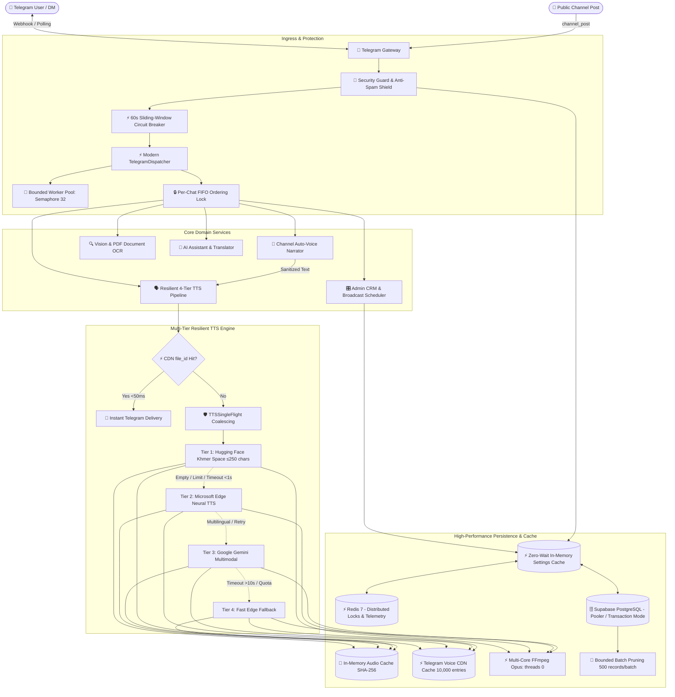

<div align="center">

# 🎙️ Bot Voice
### Next-Generation Multilingual Text-to-Speech, OCR, Telegram Dispatcher & AI Assistant

[](https://python.org)
[](https://core.telegram.org/bots/api)
[](https://deepmind.google/technologies/gemini/)
[](https://supabase.com)
[](https://www.docker.com)
[](LICENSE)

*High-performance, low-latency voice synthesis in Khmer & 10+ languages, image OCR transcription, intelligent multimodal chat, hardened non-blocking webhook dispatcher, and full-featured broadcast scheduling.*

[Features](#-key-features) • [Quickstart](#-quickstart-in-3-steps) • [Deployment](#-easy-server-deployment) • [Admin Panel](#-telegram-admin-panel-admin) • [Dispatcher & Performance](#-telegram-dispatcher--performance-architecture) • [Architecture](#-architecture) • [Project Structure](#-project-structure)

---
</div>

## ✨ Key Features

| Domain | Capabilities |
| :--- | :--- |
| 🗣️ **Text-to-Speech (TTS)** | High-speed Edge TTS & Hugging Face Kiri Space integration. Supports **Khmer**, English, Chinese, Korean, Japanese, Hindi, Malay, Indonesian, Filipino, and Arabic. |
| ⚡ **Zero-Latency CDN Caching** | **< 50ms response & 0 VPS egress** via multi-tier Telegram voice `file_id` caching. Identical text delivers instantly from Telegram worldwide CDN without speech re-synthesis. |
| 🛡️ **Hardened Telegram Dispatcher** | Non-blocking asynchronous update ingestion, bounded concurrency (`asyncio.Semaphore`), backpressure queue limits, and per-chat FIFO sequential ordering. Completely eliminates Telegram webhook retry storms. |
| 🔒 **Timing-Safe Security** | Constant-time HMAC authentication (`hmac.compare_digest`) on secret tokens before mode inspection, preventing info leaks. Body streaming validation up to 2MB. |
| 📢 **Channel Auto-Voice Narrator** | Automatically synthesizes studio-grade voice note narration for Telegram channel posts (text & captions) with smart URL/delimiter cleaning, sentence-level cuts, `#notts` opt-out tags, and whitelist control. |
| 📄 **PDF & Document Voice Synthesis** | Reads `.pdf` documents uploaded by users, transcribes text using Gemini Multimodal Vision, and outputs interactive voice playback. |
| 🔍 **Image OCR** | Instant text extraction from photos, documents, and screenshots using Google Gemini multimodal vision with automatic model fallback (`gemini-2.0-flash`). |
| 🎙️ **Voice & Audio Transcription** | Transcribes Telegram voice notes and uploaded audio files (`.mp3`, `.wav`, `.m4a`, `.ogg`) into text. |
| 🎵 **Audio to Voice Note** | Converts standard MP3/audio files into native Telegram Opus voice message bubbles. |
| 🎛️ **Live Admin Controls (`/admin`)** | Full in-app control panel for maintenance mode, feature toggles, Audio Cache & CDN purge, performance tuning, and CRM user lookups. |
| 📢 **Broadcast Engine** | Instant broadcasts, scheduled announcements (Phnom Penh UTC+7), daily recurrence, and bulk blocked-user persistence (99% Supabase API savings). |
| ⚡ **Zero-Disk Streaming & Caching** | Multi-threaded FFmpeg Opus encoding (`-threads 0`, `-compression_level 5`) with VoIP low-latency compression, deterministic Unicode NFC SHA-256 deduplication, and `TTSSingleFlight` coalescing. |
| 🛡️ **Self-Healing Infrastructure** | 4-tier resilient speech fallback (HF $\to$ Edge $\to$ Gemini $\to$ Emergency Edge), idle database reconnection recovery (`RemoteProtocolError` resilience), and rate limits. |

---

## ⚡ Quickstart in 3 Steps

### 1. Clone & Install Dependencies
```bash
git clone https://github.com/Heng-zm/bot-voice.git
cd bot-voice
python -m pip install -r requirements.txt
```

### 2. Configure Minimal Environment (Only 5 Lines!)
Copy `.env.example` to `.env` and fill in your keys:
```bash
cp .env.example .env
```
```env
TELEGRAM_BOT_TOKEN=123456789:ABCdefGhIJKlmNoPQRsTUVwxyZ
ADMIN_IDS=1272791365
SUPABASE_URL=https://your-project.supabase.co
SUPABASE_SERVICE_ROLE_KEY=your-supabase-service-role-key
GEMINI_API_KEY=your-gemini-api-key
```

### 3. Launch the Bot
```bash
python -m app.main
# or
./start.sh
```

---

## 🚀 Easy Server Deployment

### 🐳 Option 1: Docker Compose (Recommended)
Deploy 24/7 in a background container with automated health management and log rotation:
```bash
# 1. Edit your .env file
cp .env.example .env

# 2. Build and run
docker compose up -d --build

# 3. View live output
docker compose logs -f
```

---

### ⚡ Option 2: Automated 1-Click VPS Script (`deploy.sh`)
Works on any Linux VPS (**Ubuntu 22.04 / 24.04, Debian 12, CentOS, AlmaLinux**):
```bash
chmod +x deploy.sh
./deploy.sh
```
*The script automatically checks dependencies, creates virtual environments, verifies FFmpeg, and starts the service.*

---

### ☁️ Option 3: Anajak Cloud (https://anajak.cloud/)

#### 🚀 Method 1: Web Panel Archive Upload (Pterodactyl - Recommended & Easiest)
1. Open [my.anajak.cloud](https://my.anajak.cloud) and select your server.
2. Go to **Files** and upload `bot-voice-update.zip` (462 KB).
3. Click `...` next to `bot-voice-update.zip` and choose **Unarchive**.
4. Go to **Console** and click **Restart**.

#### ⚡ Method 2: Automated SFTP Upload
Run the native batch script in PowerShell or Command Prompt:
```cmd
.\upload-zip.bat
# or upload all source trees:
.\upload.bat
```
*(Enter your Anajak Cloud account password when prompted)*

#### 🛠️ Method 3: 1-Click Automated VPS Script via SSH
```bash
git clone https://github.com/Heng-zm/bot-voice.git
cd bot-voice
chmod +x anajak-deploy.sh
./anajak-deploy.sh
```

##### 🛠️ Anajak Cloud Management Toolkit:
```bash
./anajak-deploy.sh logs      # View live streaming container logs
./anajak-deploy.sh status    # Check container health and memory usage
./anajak-deploy.sh restart   # Restart bot and redis containers
./anajak-deploy.sh test      # Run automated unit test suite inside Docker
./anajak-deploy.sh backup    # Run Supabase database backup utility
./anajak-deploy.sh update    # Pull latest Git code and rebuild containers
./anajak-deploy.sh stop      # Stop all background services
```

---

### 🌐 Option 4: Wasmer Edge (https://wasmer.io)

Deploy globally to Wasmer Edge with zero server maintenance:
```bash
# 1. Install Wasmer CLI (if not already installed)
curl https://get.wasmer.io -sSfL | sh

# 2. Login to your Wasmer account
wasmer login

# 3. Deploy using the configured wasmer.toml
wasmer deploy
```
*Wasmer will automatically package the container, deploy to the edge network, and expose your `/healthz`, `/system`, `/tts`, and Telegram Webhook endpoints globally.*

---

### ⚙️ Option 5: Linux Systemd Daemon (Native VPS Service)
```bash
# 1. Copy service template
sudo cp bot-voice.service /etc/systemd/system/bot-voice.service

# 2. Edit paths & user
sudo nano /etc/systemd/system/bot-voice.service

# 3. Enable & Start
sudo systemctl daemon-reload
sudo systemctl enable --now bot-voice

# 4. View status & logs
sudo systemctl status bot-voice
journalctl -u bot-voice -f
```

---

## ⚡ Telegram Dispatcher & Performance Architecture

### 1. Hardened Telegram Update Dispatcher (`app/services/telegram/dispatcher.py`)
- **Non-Blocking Webhook Ingestion**: Ingests updates, validates tokens, and claims deduplication leases before dispatching to a tracked background worker pool. Responds with `200 OK` (`{"status": "ok", "dispatched": true}`) to Telegram in **< 5ms**, completely preventing webhook connection timeouts and duplicate retry storms.
- **Bounded Concurrency with Backpressure**: Uses `asyncio.Semaphore` (`DISPATCHER_MAX_CONCURRENCY=32`) and a configurable queue depth (`DISPATCHER_MAX_QUEUE_DEPTH=100`). Saturated queues gracefully shed load with `503 Service Unavailable (Retry-After: 2)`.
- **Per-Chat FIFO Sequential Ordering**: Bounded LRU `_get_chat_lock(chat_id)` ensures rapid multi-message bursts from the same user or channel are processed sequentially without race conditions, while different chats process with full concurrency.
- **Cancellation-Safe Shutdown Drain**: Explicitly catches `asyncio.CancelledError` to release deduplication leases during server restart `drain(timeout=10.0)`, avoiding `503 already_processing` deadlocks on subsequent boots.
- **Security-First Verification**: Constant-time HMAC comparison (`hmac.compare_digest`) on secret tokens occurs *before* mode checking, preventing server configuration leakage to unauthorized callers.

### 2. Multi-Tier Audio Cache & Response Acceleration
- **Zero-Latency Fast-Path**: On cache hit, delivers `msg.reply_voice(voice=file_id)` directly in **< 50ms**, bypassing progress message creation, editing, and deletion (saving 3 Telegram round-trips).
- **SingleFlight Coalescing (`TTSSingleFlight`)**: Concurrent duplicate requests coalesce into 1 synthesis execution (1 leader, $N$ followers awaiting the future).
- **FFmpeg Opus Multi-Core Tuning**: `-threads 0` and VoIP-optimized `-compression_level 5` accelerate audio conversion by ~30% with zero perceptual quality degradation.
- **Unblocked Asyncio Event Loop**: Removed blocking synchronous `gc.collect()` from hot request loops, eliminating 10–50ms event-loop freezes per message.

---

## 🎛️ Telegram Admin Panel (`/admin`)

Manage every aspect of your bot dynamically from Telegram or the Web Admin Dashboard without editing `.env` or restarting servers:

```
/admin
├── ⚙️ Settings          — Toggle TTS, OCR, Voice Transcribe, AI Resolver, Maintenance Mode
├── 🚀 Audio Cache       — Live CDN File ID hit rate %, in-memory LRU usage MB, and 1-click cache purge
├── ⚡ Performance       — Hot-reload DB Workers, Audio Cache MB, TTL, Edge Parallel Streams
├── 📢 Broadcasts        — Compose, preview, schedule (Phnom Penh UTC+7), and template manager
├── 👥 User CRM          — Search user by ID/@username, inspect preferences, block/unblock
├── 📊 Live Metrics      — Real-time memory usage, dispatcher telemetry, cache hit ratios, and latency graphs
└── 🚨 Error Center      — Inspect recent runtime exceptions and stack traces
```

---

## 🏗️ Architecture



---

## 📁 Project Structure

```
bot-voice/
├── app/                              # Core Application Codebase
│   ├── api/                          # FastAPI Modular Routes
│   │   ├── routes/
│   │   │   ├── ai.py                 # Gemini AI assistant & chat endpoints
│   │   │   ├── system.py             # Health checks & runtime stats
│   │   │   ├── telegram.py           # Webhook ingestion & /dispatcher-status
│   │   │   └── tts.py                # Public Text-to-Speech API
│   │   └── __init__.py
│   ├── core/                         # Core Configurations & Security
│   │   ├── config.py                 # Pydantic Settings & environment variables
│   │   ├── security.py               # API Key authentication & validation
│   │   └── telegram_auth.py          # Admin dynamic authorization & fallback
│   ├── services/                     # Domain Services Architecture
│   │   ├── ai/                       # AI, Multimodal Vision & Embeddings
│   │   │   ├── gemini.py             # Google Gemini client & auto-fallback (2.0/1.5)
│   │   │   ├── ocr.py                # Multi-provider Vision OCR & PDF pipeline
│   │   │   ├── language.py           # Fast regex + langdetect language detection
│   │   │   ├── providers.py          # Provider interfaces & routing
│   │   │   └── vector_store.py       # Upstash / Supabase Vector similarity search
│   │   ├── broadcast/                # Mass Messaging & Scheduled Announcements
│   │   │   └── templates.py          # Broadcast layout templates & presets
│   │   ├── settings/                 # Dynamic Runtime Configuration Store
│   │   │   └── store.py              # Supabase/PostgreSQL settings key-value store
│   │   ├── telegram/                 # Modular Telegram Bot System
│   │   │   ├── buttons.py            # Inline keyboard layouts & UI builders
│   │   │   ├── callbacks.py          # Inline button callback queries & state machine
│   │   │   ├── channel.py            # Channel Auto-Voice Narrator & fast-path
│   │   │   ├── commands.py           # Command handlers (/ask, /tts, /admin, /help)
│   │   │   ├── deduplication.py      # WebhookReplayStore & atomic claim leases
│   │   │   ├── dispatcher.py         # ⚡ Hardened Telegram Update Dispatcher Engine
│   │   │   ├── flow.py               # Pure callback classification & error helpers
│   │   │   ├── guards.py             # Rate limits, flood control & channel protection
│   │   │   ├── media.py              # Voice, photo, audio, document & TTS fast-path
│   │   │   ├── routing.py            # Central Telegram handler registration
│   │   │   ├── security.py           # Admin authentication & privilege enforcement
│   │   │   └── workloads.py          # Background worker tasks & audio rendering
│   │   ├── tts/                      # Text-to-Speech Engines & Pipelines
│   │   │   ├── cache.py              # Multi-tier Telegram CDN & raw audio cache
│   │   │   ├── engine.py             # Edge TTS & Hugging Face Kiri integration
│   │   │   └── voices.py             # Supported voice catalogs & mappings
│   │   ├── users/                    # User CRM & Preferences
│   │   │   └── prefs.py              # User language, voice, and speed persistence
│   │   └── health.py                 # Internal health probe server
│   ├── utils/                        # Shared Utilities
│   │   ├── file_io.py                # Safe temp file lifecycle & cleanup
│   │   ├── text.py                   # Khmer & multilingual text sanitization
│   │   └── time.py                   # Phnom Penh (UTC+7) timezone formatting
│   ├── bot.py                        # Telegram Bot builder & polling runner
│   ├── legacy.py                     # Legacy engine compatibility & state
│   └── main.py                       # FastAPI application & lifespan management
├── tests/                            # Comprehensive Automated Test Suite
│   ├── test_article_narrator.py      # Web article & long text narrator tests
│   ├── test_backend_services.py      # Core service unit tests
│   ├── test_channel_narrator.py      # Channel narrator & audio text cleaning tests
│   ├── test_dispatcher.py            # ⚡ Telegram Dispatcher & concurrency tests
│   ├── test_startup_script.py        # Startup script validation
│   ├── test_system_upgrades.py       # API & webhook regression tests
│   ├── test_telegram.py              # Telegram command & message tests
│   ├── test_telegram_auth.py         # Admin authorization tests
│   └── test_tts_cache.py             # ⚡ Deterministic SHA-256 & CDN cache tests
├── Dockerfile                        # Multi-stage production container image
├── docker-compose.yml                # Docker Compose orchestration (Bot + Redis)
├── anajak-deploy.sh                  # 1-click Anajak Cloud deployment script
├── bot-voice-update.zip              # Pre-packaged production deployment archive
├── deploy.sh                         # 1-click Linux VPS automated installer
├── upload.bat                        # Automated SFTP batch uploader (full)
├── upload-zip.bat                    # Fast SFTP archive uploader
├── upload.sftp                       # SFTP script for full codebase
├── upload-zip.sftp                   # SFTP script for zip archive
├── requirements.txt                  # Production dependencies
├── requirements-dev.txt              # Development & testing dependencies
├── start.sh                          # Production container startup script
└── supabase_bot_setup.sql            # PostgreSQL schema, migrations & RLS

---

## 🧪 Testing & Verification

Run the full automated test suite (50+ tests covering language detection, security, replay stores, TTS caching, SingleFlight, and the Telegram Dispatcher):

```bash
# Run all unit tests
python -m unittest discover -s tests -v

# Test Dispatcher specifically
python -m unittest tests.test_dispatcher

# Test Audio Cache & SingleFlight
python -m unittest tests.test_tts_cache

# Run Ruff code linter
python -m ruff check .
```

---

## 📄 License

This project is licensed under the **MIT License**. See the [LICENSE](LICENSE) file for details.
