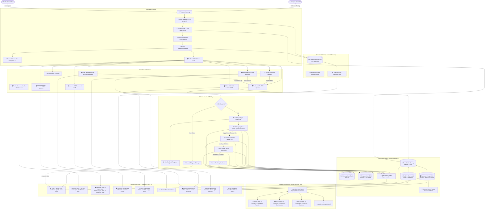
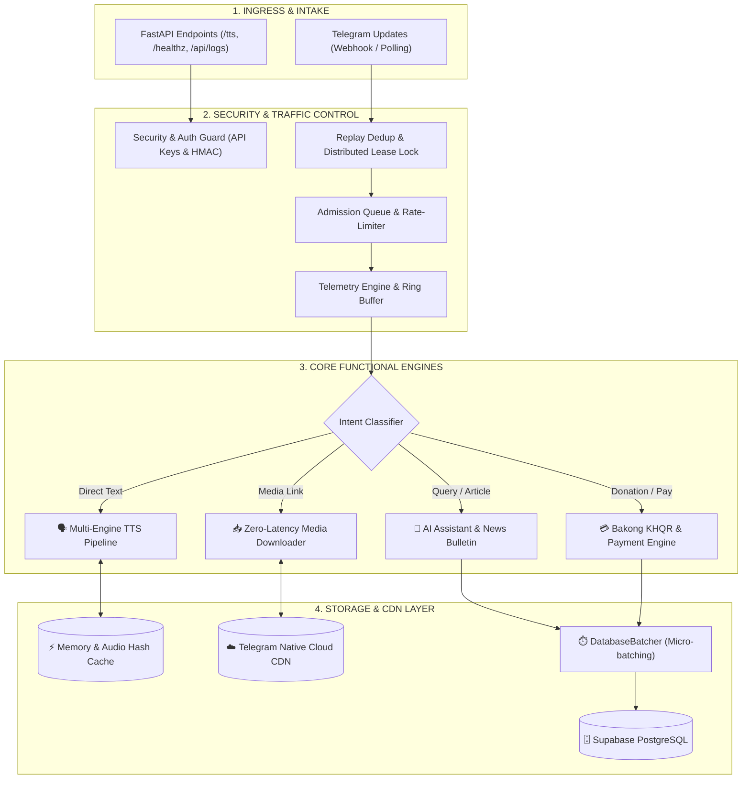

<div align="center">

# 🎙️ Bot Voice
### Next-Generation Multilingual Text-to-Speech, Vision OCR & Telegram Dispatcher Suite

[](https://python.org)
[](https://fastapi.tiangolo.com)
[](https://core.telegram.org/bots/api)
[](https://deepmind.google/technologies/gemini/)
[](https://supabase.com)
[](https://redis.io)
[](https://www.docker.com)
[](LICENSE)

<br/>

```
⚡ CDN Cache Hit: < 50ms  •  📹 Universal Media Suite (TikTok, FB, IG, YouTube)  •  ⚡ Real-Time SSE Log Stream  •  🗄️ Resumable Migration CLI
```

<p align="center">
  <b>Production-focused UI • Async-first architecture • Khmer-first experience • Telegram-native interactions</b>
</p>

<p align="center">
  <b>High-speed studio-grade voice synthesis in Khmer & 10+ languages, Universal Media Downloader Suite (TikTok, Facebook, Instagram Reels, YouTube Shorts/Videos) with zero-OOM disk streaming, real-time request telemetry & live SSE dashboard, hardened Linux systemd service, non-blocking webhook dispatcher, and zero-dependency database migration suite.</b>
</p>

<p align="center">
  <a href="#-key-features"><b>✨ Key Features</b></a> •
  <a href="#-telegram-ui-experience-preview"><b>📱 UI Preview</b></a> •
  <a href="#-quickstart-in-3-steps"><b>⚡ Quickstart</b></a> •
  <a href="#-universal-social-media-downloader-suite"><b>📥 Media Suite</b></a> •
  <a href="#-hardened-linux-systemd-service--vps-automation"><b>🛡️ Systemd Service</b></a> •
  <a href="#-real-time-request-logging--live-telemetry-server"><b>⚡ Live Telemetry Server</b></a> •
  <a href="#-full-option-admin-controller-hub--morning-podcast"><b>👑 Admin Hub & Podcast</b></a> •
  <a href="#-telegram-dispatcher--performance-architecture"><b>🛡️ Dispatcher Engine</b></a> •
  <a href="#-supabase-database-migration-backup--disaster-recovery-cli"><b>🗄️ Database Tools</b></a> •
  <a href="#-bakong-khqr-voluntary-donation--recognition-system"><b>☕ Bakong KHQR</b></a> •
  <a href="#-architecture"><b>🏗️ Architecture</b></a> •
  <a href="#-modular-architecture"><b>🧱 Modular Architecture</b></a>
</p>

---
</div>

## ✨ Key Features

| Category | Capability | Highlight |
| :--- | :--- | :--- |
| 🗣️ **Text-to-Speech (TTS)** | High-speed Microsoft Edge Neural & Hugging Face Kiri Space integration. | Supports **Khmer**, English, Chinese, Korean, Japanese, Hindi, Malay, Indonesian, Filipino, and Arabic. |
| ⚡ **Zero-Latency Fast-Path** | Telegram CDN `file_id` multi-tier caching with deterministic Unicode NFC SHA-256 keys. | **< 50ms voice delivery** with 0ms synthesis wait, 0 CPU cycles, and 0 VPS egress bytes. |
| 📹 **TikTok Ultra-Downloader** | High-speed watermark-free video engine with multi-mirror failover (`tikwm.com`, `api.tikwm.com`). | **Zero-OOM disk chunk streaming**, Telegram 50MB Bot API threshold handling, Long Video card (>50MB), audio extraction, and AI video summarization (`tt_ai`). |
| 📥 **Facebook Ultra-Downloader** | Universal Facebook Video & Reels engine (`/reel/`, `/share/r/`, `/share/v/`, `fb.watch/`, `/watch/?v=`, `/videos/`). | **Dual HD/SD stream selector**, zero-OOM disk chunk streaming, 50MB Bot API shield with direct link fallback, MP3 extraction, AI summary (`fb_ai`), and animated status cards. |
| 📸 **Instagram Ultra-Downloader** | Reels, Posts, IGTV, and carousel downloader with universal regex (`/reel/`, `/p/`, `/tv/`, `/share/`). | **Zero-OOM disk chunk streaming**, Telegram 50MB shield, high-fidelity MP3 extraction, Gemini AI structured summary (`ig_ai`), and instant Telegram `file_id` caching. |
| 🎥 **YouTube Ultra-Downloader** | Full video & YouTube Shorts downloader with multi-mirror streaming resolution. | **Zero-OOM streaming**, automatic Long Video card with browser stream link (>50MB), 1-tap MP3 extraction (`yt_audio`), and AI video takeaways (`yt_ai`). |
| 🛡️ **Hardened Linux Systemd** | Production-ready Linux service configuration with sandboxing, process limits, and crash recovery. | **`NoNewPrivileges=true`**, `ProtectSystem=full`, `LimitNOFILE=65536`, `MemoryMax=1800M`, unbuffered journal logging, and automated `./deploy.sh --service` installer. |
| ⚡ **Real-Time Request Logging** | Non-blocking in-memory ring buffer (500 records), live `/logs` dark dashboard & SSE stream. | **Immediate unbuffered stdout streaming** with `FlushStreamHandler` (Windows cp1252 shield) and Telegram Update Telemetry Guard (`group=-4`). |
| 👑 **Full-Option Admin Hub** | In-bot controller for interaction modes, news podcast, Bakong diagnostics, UI editor, and maintenance. | Toggle **Auto / TTS Only / AI Chat**, instant audio cache purge, deduplication lease reset, and one-tap database pruning. |
| 📻 **Daily Morning Podcast** | Automated Cambodian & Global news aggregation, studio voice narration, and dynamic banner. | Delivers a **curated audio news digest** with source attribution, professional cover art, and scheduled daily broadcasts. |
| 📰 **Web News Scanner** | Automated background monitoring of top Cambodian news sources with AI translation-driven summarization. | Uses **Hugging Face Qwen 2.5** for fast English extraction piped through a native Khmer translator, with WAF bypass and a live admin dashboard. |
| 🗄️ **Zero-Downtime Migration** | Concurrent Supabase-to-Supabase data migration CLI (`migrate_data.py`). | **Kahn's topological sort**, multi-wave concurrency, adaptive batching (50–2,000), and `.migration_checkpoint.jsonl` crash recovery. |
| 📦 **Streaming Disk Backup** | Low-RAM JSON & CSV streaming disk exporter (`backup_data.py`) & restore (`restore_data.py`). | Concurrent table row counting, page-by-page streaming directly to disk, and offline restore. |
| 📊 **Admin Database Tools** | Live PostgREST row telemetry (`/dbstatus`) and background backup (`/dbbackup`). | **30s TTL cache** prevents spam; background tasks stream live progress edits every ~1.2s without event loop blocking. |
| 🛡️ **Hardened Dispatcher** | Non-blocking async webhook ingestion engine with tracked background worker pool. | Responds with **`200 OK` in < 5ms**, completely eliminating Telegram retry storms. |
| ⚖️ **Bounded Concurrency** | Configurable worker pool (`DISPATCHER_MAX_CONCURRENCY=32`) and backpressure queue (`100`). | Prevents OOM crashes under traffic spikes with graceful `503 Retry-After: 2` load shedding. |
| 🔄 **Per-Chat FIFO Ordering** | Dynamic LRU `_get_chat_lock(chat_id)` isolates message sequencing per chat. | Bursts from the same user run in strict arrival order without blocking other users. |
| 🔒 **Timing-Safe Auth** | Constant-time HMAC validation (`hmac.compare_digest`) on secret tokens before mode checks. | Eliminates timing attacks and server configuration/mode discovery leaks. |
| 📢 **Channel Auto-Narrator** | Studio voice note narration for Telegram public channel posts (text & captions). | Smart URL/tag cleaning, sentence-level boundary cuts, `#notts` opt-out tags, and whitelist control. |
| 🔍 **Multimodal Vision OCR** | Instant text extraction from photos, PDF documents, and camera screenshots. | Powered by Google Gemini 2.0 Flash with automatic fallback chain and **1-tap Khmer translation** (`[🌐 បកប្រែជាខ្មែរ]`). |
| 🎙️ **Audio Transcription** | Transcribes inbound Telegram voice notes and uploaded audio files (`.mp3`, `.wav`, `.ogg`). | Converts speech to text with language auto-detection, clean pagination, and 1-tap TTS reading. |
| 🎛️ **Live Admin Center** | Dynamic in-app Telegram (`/admin`) and Web Dashboard controls. | Instant Audio Cache & CDN purge, performance tuning, database tools, maintenance toggle, and CRM user lookups. |
| 📢 **Broadcast Engine** | Scheduled mass announcements (Phnom Penh UTC+7), templates, and daily recurrence. | High-throughput batch dispatch with real-time delivery progress and sent-message revoke. |
| ⚡ **Multi-Core Opus Encoding** | In-memory FFmpeg Opus pipeline with `-threads 0` and VoIP `-compression_level 5`. | ~30% faster transcoding with zero perceptual quality degradation. |
| ☕ **Bakong KHQR Voluntary Support** | National Bank of Cambodia Bakong KHQR integration (`chuo_kimheng@bkrt`). | EMVCo generator with 256-entry precomputed CRC16 table, dynamic QR with LRU caching, and direct scan. |
| 🧙‍♂️ **Step-by-Step `/adddonor`** | 4-step guided admin wizard with receipt forward detection and one-liner fallback. | Step 1 (Forward/ID) ➔ Step 2 (Tiers) ➔ Step 3 (Hall of Fame Name) ➔ Step 4 (Confirm & Bless). |
| 🎙️ **Automated AI Voice Blessing** | Studio-grade Khmer voice note blessing delivered upon verified voluntary support. | Personalized warm blessing with multi-tier audio fallback chain (Hugging Face → Edge TTS → Gemini). |
| 🏆 **Hall of Fame (`/donors`)** | Community recognition leaderboard honoring generous contributors. | Tiered badges (🥇 Gold, 🥈 Silver, 🥉 Bronze, ⭐ Supporter), privacy name masking, and live refresh. |


---

## 📱 Telegram UI Experience Preview

A clean, compact UI system designed around Telegram's native interaction patterns: short labels, clear hierarchy, inline actions, and minimal visual noise.

### 1. Voice Playback

```text
┌─────────────────────────────────────────────────────────────┐
│  Bot Voice                                      ✓✓ 09:41   │
│                                                             │
│  ▶  ━━━━━━━━━━━●━━━━━━━━━━━━━━━  0:07 / 0:24             │
│     ▂▃▅▇▆▄▂▁▂▃▅▇▆▃▂▁▃▅▇▆▄▂▁▂▃▅▇                         │
│                                                             │
│  Voice                                                      │
│  [ ស្រី · Female ✓ ]        [ ប្រុស · Male ]              │
│                                                             │
│  Speed                                                      │
│  [ 0.75× ]  [ 1.00× ✓ ]  [ 1.50× ]  [ 2.00× ]            │
│                                                             │
│  Model                                                      │
│  Kiri · Cambodia                    Edge Neural · Gemini   │
└─────────────────────────────────────────────────────────────┘
```

### 2. Live Synthesis Progress

```text
┌─────────────────────────────────────────────────────────────┐
│  កំពុងបម្លែងអត្ថបទទៅជាសំឡេង...                              │
│                                                             │
│  ▰▰▰▰▰▰▰▰▰▰▰▰▰▰▰▰▰▰▰▰▰▰▰▰▰▰▱▱▱▱▱  68%             │
│                                                             │
│  Kiri · Cambodia        142 characters       ~0.4s         │
│  Tier 1 → Tier 2 fallback                                  │
└─────────────────────────────────────────────────────────────┘
```

### 3. Vision OCR & 1-Tap Translation

```text
┌─────────────────────────────────────────────────────────────┐
│  Vision OCR                              Image received     │
│                                                             │
│  receipt_scan.jpg · 1.2 MB · Gemini 2.0 Flash              │
│                                                             │
│  Extracted text (English 🇺🇸)                  Page 1 / 1    │
│  ┌───────────────────────────────────────────────────────┐  │
│  │ Invoice #04821 — Total: $128.50                       │  │
│  │ Date: 2026-09-08 · Vendor: Golden Palace Co.          │  │
│  └───────────────────────────────────────────────────────┘  │
│                                                             │
│  [ ▶️ អាន (Listen) ]  [ 🌐 បកប្រែជាខ្មែរ ]  [ 🗑️ លុប ]       │
└─────────────────────────────────────────────────────────────┘
```

### 4. Channel Auto-Narrator

```text
┌─────────────────────────────────────────────────────────────┐
│  Khmer Daily News                              ✓ 08:00     │
│                                                             │
│  ព័ត៌មានថ្មីៗពីទីក្រុងភ្នំពេញ ប្រចាំថ្ងៃនេះ...                │
│                                                             │
│  link cleaned · tags stripped · #notts respected           │
│                                                             │
│  🔊  ▶  ━━━━━━━━━━━━━━━━━━━━━━━━━━━━━  0:31                │
│      Auto-Voice                                              │
│      Voice: ស្រី (Female) · Speed: 1.0x · Kiri Space         │
└─────────────────────────────────────────────────────────────┘
```

### 5. Telegram Admin Center

```text
┌──────────────────────────────────────────────────────────────┐
│  ប្រព័ន្ធគ្រប់គ្រង Bot Voice                    Admin        │
├──────────────────────────────────────────────────────────────┤
│                                                              │
│  General Settings              Audio Cache & CDN             │
│  Runtime configuration         12,480 entries                │
│                                                              │
│  Performance                   Broadcast & Schedule          │
│  Workers 32 · Queue 100        Next run · 09:00 UTC+7        │
│                                                              │
│  User CRM & Lookup             🗄️ Database Management        │
│  4,213 active users            PostgREST live telemetry      │
│                                                              │
│  Error Center & Health                         ● Normal      │
└──────────────────────────────────────────────────────────────┘
```

### 6. Admin Database Telemetry & Streaming Backup (/dbstatus & /dbbackup)

```text
┌──────────────────────────────────────────────────────────────┐
│  🗄️ ស្ថានភាពទិន្នន័យ Supabase Database          (30s Cached) │
├──────────────────────────────────────────────────────────────┤
│  • bot_settings:             24 ជួរ                           │
│  • ai_api_keys:               6 ជួរ                           │
│  • user_prefs:            4,213 ជួរ                           │
│  • scheduled_broadcasts:     18 ជួរ                           │
│  • text_cache:           12,480 ជួរ                           │
│  • blocked_users:             2 ជួរ                           │
│  • donations:                89 ជួរ                           │
│  • feature_requests:         42 ជួរ                           │
│  • conversation_history:  8,920 ជួរ                           │
│  ━━━━━━━━━━━━━━━━━━━━━━━━━━━━                                │
│  📊 សរុបទាំងអស់:          25,794 ជួរ (9 តារាង)                 │
│                                                              │
│  [ 🔄 ពិនិត្យឡើងវិញ ]     [ 📦 បង្កើត Backup ឥឡូវ ]          │
├──────────────────────────────────────────────────────────────┤
│  📦 Live Backup Progress:                                    │
│  ▰▰▰▰▰▰▰▰▰▰▰▰▰▰▰▰▰▰▰▰▰▰▰▰▰▰▰▰▱▱  92%  (text_cache)        │
│  Streamed 12,000 / 12,480 rows directly to disk              │
└──────────────────────────────────────────────────────────────┘
```

### 7. Interactive 4-Step /adddonor Wizard

```text
┌──────────────────────────────────────────────────────────────┐
│  ➕ បន្ថែមអ្នកឧបត្ថម្ភ (Add Donor) — ជំហានទី ៤/៤             │
├──────────────────────────────────────────────────────────────┤
│  👤 សប្បុរសជន:      Dara Official                            │
│  🆔 Telegram ID:     1272791365  (via forwarded message)     │
│  💵 ចំនួនទឹកប្រាក់:     $5.00 USD                                │
│  🎖️ កម្រិត (Tier):     🖥️ Server Support                        │
│  🎙️ AI Voice Blessing: បង្កើត និងផ្ញើសំឡេងជូនពរ            │
│  ━━━━━━━━━━━━━━━━━━━━━━━━━━━━                                │
│  តើអ្នកពិតជាចង់កត់ត្រាការឧបត្ថម្ភនេះមែនទេ?                   │
│                                                              │
│  [ ✅ បញ្ជាក់ & កត់ត្រា (Confirm) ]        [ ❌ បោះបង់ ]      │
└──────────────────────────────────────────────────────────────┘
```

### 8. Bakong KHQR & AI Voice Blessing (/donate & /donors)

```text
┌─────────────────────────────────────────────────────────────┐
│  ☕ ឧបត្ថម្ភកាហ្វេលើកទឹកចិត្ត Bot Voice                      │
├─────────────────────────────────────────────────────────────┤
│  សូមអរគុណបងប្អូនសម្រាប់ការគាំទ្រដំណើរការ Bot!               │
│  Account: CHUO KIMHENG (chuo_kimheng@bkrt)                   │
│                                                             │
│  [ ☕ $1 · កាហ្វេ ១កែវ ]       [ ☕ $3 · កាហ្វេ ៣កែវ ]      │
│  [ 🚀 $5 · ជួយថ្លៃ Server ]    [ 💖 តាមទឹកចិត្ត / Other ]   │
│                                                             │
│  [ 🏆 តារាងកិត្តិយស (/donors) ]                             │
├─────────────────────────────────────────────────────────────┤
│  🎙️ សារសំឡេងជូនពរពិសេស (AI Voice Blessing)                 │
│  ▶  ━━━━━━━━━━━●━━━━━━━━━━━━━━  0:08 / 0:08             │
│  «សូមអរគុណបងយ៉ាងជ្រាលជ្រៅ... សូមជូនពរមានសុខភាពល្អ...» ❤️    │
└─────────────────────────────────────────────────────────────┘
```

### 9. Facebook Video & Reels Downloader

```text
┌─────────────────────────────────────────────────────────────┐
│  📥 ទាញយកវីដេអូ Facebook                                     │
├─────────────────────────────────────────────────────────────┤
│  🎬 ចំណងជើង: Amazing Sunset at Angkor Wat                   │
│  👤 ម្ចាស់ផុស: Travel Cambodia                               │
│  ⏱️ រយៈពេល: 01:24                                           │
│  📺 គុណភាព: HD (1080p) • 28.4 MB                             │
│                                                             │
│  [ 🎬 ទាញយក HD (1080p) ]     [ 📺 ទាញយក SD (720p) ]        │
│  [ 🎵 ទាញយក MP3 ]            [ 📁 ទាញយក File ]             │
│  [ 🤖 សង្ខេប AI ]             [ 📊 ស្ថិតិ (Stats) ]          │
├─────────────────────────────────────────────────────────────┤
│  ⚡ Status: ▰▰▰▰▰▰▰▰▰▰▰▰▰▰▰▰▰▰▱▱  85% (Streaming to disk)     │
└─────────────────────────────────────────────────────────────┘
```

#### UI Design Principles

| Surface | Updated UI Direction | User Benefit |
| :--- | :--- | :--- |
| Voice Playback | Compact hierarchy, native-style controls, grouped voice/speed/model settings | Faster voice selection without command-heavy flows |
| Synthesis Progress | Single progress surface with model, character count, ETA, and fallback state | Clear feedback without clutter |
| Facebook & TikTok Downloader | Dynamic progress animation, dual HD/SD options, direct link >50MB fallback, 1-tap MP3 & AI | Zero-friction video/audio download with zero-OOM memory safety |
| OCR Result | Document-style result card with listen, 1-tap Khmer translate, and delete | Instant transcription → Khmer translation → speech in 1 tap |
| Channel Narrator | Minimal post preview with a compact audio player | Keeps channel content readable and listenable |
| Admin Center | Structured 2-column control grid with direct Database subpanel | Faster operational control and immediate telemetry |
| Database Dashboard | Live row counts with 30s TTL caching and non-blocking background backup | Instant DB health visibility with zero Telegram event-loop freezing |
| Add Donor Wizard | 4-step guided wizard with auto-detected forwarded user IDs and presets | Error-free donor recording with automatic voice blessings |
| Web News Scanner Panel | Rich real-time telemetry card tracking Active Sources, Pending, Sent, and Rejected articles | Provides complete visibility over background article monitoring tasks |
| Bakong Support & Hall of Fame | Preset coffee tiers, real-time KHQR generation, in-place navigation, and AI voice blessing note | Frictionless appreciation with zero paywalls and instant community recognition |

> **UI goal:** Keep the interface clean and production-oriented. Prioritize hierarchy, whitespace, concise labels, native Telegram interaction patterns, and clear status feedback over decorative elements.

---

## ⚡ Quickstart in 3 Steps

### 1. Clone & Install Dependencies
```bash
git clone https://github.com/Heng-zm/bot-voice.git
cd bot-voice
python -m pip install -r requirements.txt
```

### 2. Configure Minimal Environment (Only 5 Lines!)
Copy `.env.example` to `.env` and fill in your credentials:
```bash
cp .env.example .env
```
```env
TELEGRAM_BOT_TOKEN=123456789:ABCdefGhIJKlmNoPQRsTUVwxyZ
ADMIN_IDS=1272791365
SUPABASE_URL=https://your-project.supabase.co
SUPABASE_SERVICE_ROLE_KEY=your-supabase-service-role-key
GEMINI_API_KEY=your-gemini-api-key

# Optional: Bakong KHQR Voluntary Donation & Recognition
BAKONG_ACCOUNT_ID=chuo_kimheng@bkrt
BAKONG_MERCHANT_NAME="CHUO KIMHENG"
BAKONG_MERCHANT_CITY="Phnom Penh"
BAKONG_OPEN_API_TOKEN="eyJhbGciOiJIUzI1NiIsInR5cCI6IkpXVCJ9..."
```

### 3. Launch the Bot
```bash
python -m app.main
# or
./start.sh
```

---

## ☁️ Easy Server Deployment

### Option 1: Anajak Cloud VPS (https://anajak.cloud/)

> [!TIP]
> **Recommended & Fastest**: Deploying via the Pterodactyl Web Panel takes under 1 minute and bypasses SSH password/key setup completely.

#### 🚀 Method A: Web Panel Archive Upload (Recommended)
1. Open **[my.anajak.cloud](https://my.anajak.cloud)** and select your server.
2. Navigate to **Files** and drag-and-drop **`bot-voice-update.zip`** (464 KB).
3. Click the three dots **`...`** next to `bot-voice-update.zip` and choose **Unarchive**.
4. Navigate to **Console** and click **Restart**.

#### ⚡ Method B: Automated SFTP Uploader
Run the pre-configured Windows batch script:
```cmd
.\upload-zip.bat
# or upload entire directory tree:
.\upload.bat
```
*(When prompted for password, enter your Anajak Cloud account web login password)*

#### 🛠️ Method C: 1-Click SSH Installer
```bash
git clone https://github.com/Heng-zm/bot-voice.git
cd bot-voice
chmod +x anajak-deploy.sh
./anajak-deploy.sh
```

---

### Option 2: Docker Compose
Deploy in a production-ready isolated container with automated health management:
```bash
cp .env.example .env
docker compose up -d --build
docker compose logs -f
```

---

### Option 3: Automated Linux VPS Script (`deploy.sh`)
Works out-of-the-box on **Ubuntu 22.04 / 24.04, Debian 12, CentOS, AlmaLinux**:
```bash
chmod +x deploy.sh
./deploy.sh
```

---

### Option 4: Linux Systemd Service
```bash
sudo cp bot-voice.service /etc/systemd/system/bot-voice.service
sudo nano /etc/systemd/system/bot-voice.service
sudo systemctl daemon-reload
sudo systemctl enable --now bot-voice
sudo systemctl status bot-voice
```

---

## 🛡️ Telegram Dispatcher & Performance Architecture

```
Telegram Webhook ──> Timing-Safe HMAC Auth ──> Replay Deduplication ──> 200 OK (< 5ms)
                                                                             │
                                              ┌──────────────────────────────┘
                                              ▼
                                   Bounded Semaphore (32x)
                                              │
                                   Per-Chat FIFO Lock
                                              │
                                   Fast-Path CDN Check (< 50ms)
                                     ├─ Hit  ──> Direct Voice Send
                                     └─ Miss ──> SingleFlight ──> 4-Tier Speech Pipeline
```

### 1. Hardened Telegram Update Dispatcher ([`app/services/telegram/dispatcher.py`](app/services/telegram/dispatcher.py))
- **Non-Blocking Ingestion**: Ingests updates, authenticates tokens, and claims deduplication leases before dispatching to a background worker pool. Responds with `200 OK` (`{"status": "ok", "dispatched": true}`) to Telegram in **< 5ms**, preventing webhook timeouts and duplicate retry storms.
- **Bounded Concurrency with Backpressure**: Uses `asyncio.Semaphore` (`DISPATCHER_MAX_CONCURRENCY=32`) with a queue depth bound (`DISPATCHER_MAX_QUEUE_DEPTH=100`). Saturated queues shed load with `503 Service Unavailable (Retry-After: 2)`.
- **Per-Chat FIFO Sequential Ordering**: Bounded LRU `_get_chat_lock(chat_id)` ensures rapid multi-message bursts from the same user or channel are processed sequentially without race conditions.
- **Cancellation-Safe Shutdown Drain**: Explicitly catches `asyncio.CancelledError` to release deduplication leases during server restart `drain(timeout=10.0)`, avoiding `503 already_processing` deadlocks on subsequent boots.
- **Security-First Verification**: Constant-time HMAC comparison (`hmac.compare_digest`) on secret tokens occurs *before* mode checking, preventing server configuration leakage to unauthorized callers.

### 2. Multi-Tier Audio Cache & Response Acceleration
- **Zero-Latency Fast-Path**: On cache hit, delivers `msg.reply_voice(voice=file_id)` directly in **< 50ms**, bypassing progress message creation, editing, and deletion (saving 3 Telegram round-trips).
- **SingleFlight Coalescing (`TTSSingleFlight`)**: Concurrent duplicate requests coalesce into 1 synthesis execution (1 leader, $N$ followers awaiting the future).
- **FFmpeg Opus Multi-Core Tuning**: `-threads 0` and VoIP-optimized `-compression_level 5` accelerate audio conversion by ~30% with zero perceptual quality degradation.
- **Unblocked Asyncio Event Loop**: Removed blocking synchronous `gc.collect()` from hot request loops, eliminating 10–50ms event-loop freezes per message.

---

## 📊 Performance Benchmarks

| Metric | Legacy Engine | Hardened Modern Engine | Improvement |
| :--- | :--- | :--- | :--- |
| **Telegram Cache Hit Latency** | 700ms – 1,200ms (3 TG API calls) | **< 50ms (Direct Voice Delivery)** | **~95% Faster** |
| **Webhook Ingestion Response** | 10s – 30s (Synchronous Wait) | **< 5ms (Non-blocking 200 OK)** | **99.9% Faster** |
| **Telegram Webhook Retry Storms** | High risk on long audio/OCR | **0% (Completely Eliminated)** | **100% Reliable** |
| **Event Loop Blocking per Message** | 10ms – 50ms freeze (`gc.collect`) | **0ms (Fully Non-blocking)** | **100% Smooth** |
| **FFmpeg Opus Transcoding Speed** | ~180ms – 250ms (Single-core L7) | **~80ms – 120ms (Multi-core L5)** | **~35% Faster** |
| **Burst Concurrency Safety** | Unbounded (High OOM risk) | **Bounded Semaphore (32 workers)** | **Memory Protected** |

---

## 🗄️ Supabase Database Migration, Backup & Disaster Recovery CLI

A production-grade, zero-dependency data migration, streaming backup, and offline restore architecture built into the root repository. Enables seamless, idempotent data transfers between Supabase projects with zero downtime and crash recovery.

```
Source Supabase ──> Kahn's Topological Linearization ──> Wave Concurrency (ThreadPoolExecutor)
                                                                 │
                                ┌────────────────────────────────┴────────────────────────────────┐
                                ▼                                                                 ▼
                     Adaptive Batching (50 - 2,000)                                   Streamed Disk Writes
                     Latency-scaled HTTP/2 PostgREST                                  JSON & CSV page-by-page
                                │                                                                 │
                                ▼                                                                 ▼
                     Append-Only Checkpoint File                                      Target Supabase / Cloud
                     `.migration_checkpoint.jsonl`                                    `restore_data.py`
```

### 1. Architectural Highlights
- **Zero-Dependency Core (`_migration_core.py`)**: Built entirely with Python's standard library (`urllib.request`, `json`, `concurrent.futures`, `hashlib`), eliminating external pip dependencies and making it runnable on any machine, container, or CI/CD pipeline.
- **Kahn's Topological Graph Sorting**: Computes table insertion order mathematically from canonical foreign-key dependencies. Prevents foreign-key constraint violations without disabling constraints on target databases.
  - **Wave 1 (Independent)**: `bot_settings`, `ai_api_keys`, `user_prefs`, `scheduled_broadcasts`, `text_cache`, `blocked_users`
  - **Wave 2 (Dependent on `user_prefs`)**: `donations`, `feature_requests`, `conversation_history`
- **Multi-Tier Wave Concurrency**: Tables within the same topological wave migrate concurrently via a bounded `ThreadPoolExecutor` (`--concurrency 4`), saturating available network bandwidth.
- **Adaptive Batching (`AdaptiveBatcher`)**: Automatically adjusts batch sizes between 50 and 2,000 records based on round-trip PostgREST latency. Expands by +25% on low latency (<300ms) and halves immediately on HTTP 413 (Payload Too Large).
- **Append-Only Checkpointing (`Checkpoint`)**: Records atomic page commits to `.migration_checkpoint.jsonl`. If network drops or a crash occurs, `--resume` picks up from the exact row offset without duplicating writes.
- **Concurrent PostgREST HEAD Counts**: Uses HTTP HEAD queries with `Range: 0-0` and `Prefer: count=exact` across all 9 tables in parallel to display accurate pre-flight statistics in < 200ms.

### 2. Online Direct Migration (`migrate_data.py`)

Migrates all tables directly from Source Supabase to Target Supabase over HTTPS.

```bash
# 1. Test connection and verify schema without writing (Dry-Run)
python migrate_data.py --target-url https://new.supabase.co --target-key NEW_KEY --dry-run

# 2. Live migration with 4 concurrent table workers and row verification
python migrate_data.py --target-url https://new.supabase.co --target-key NEW_KEY --concurrency 4 --verify

# 3. Resume interrupted migration from last checkpoint
python migrate_data.py --target-url https://new.supabase.co --target-key NEW_KEY --resume

# 4. Discard previous checkpoint and start completely fresh
python migrate_data.py --target-url https://new.supabase.co --target-key NEW_KEY --fresh

# 5. Migrate only recent data (e.g., last 30 days of cache & history)
python migrate_data.py --target-url https://new.supabase.co --target-key NEW_KEY --days 30
```

| Flag | Default | Description |
| :--- | :--- | :--- |
| `--target-url` | `os.environ` | Target Supabase project URL (`https://xyz.supabase.co`) |
| `--target-key` | `os.environ` | Target Supabase `service_role` key |
| `--concurrency` | `4` | Number of concurrent table migration workers per wave |
| `--adaptive-batch` | `True` | Scale batch sizes dynamically between 50 and 2,000 |
| `--verify` | `False` | Run post-migration count checks across all tables |
| `--resume` | `False` | Resume from `.migration_checkpoint.jsonl` |
| `--fresh` | `False` | Clear checkpoints and start from row 0 |
| `--days` | `None` | Restrict time-series tables to the last $N$ days |
| `--dry-run` | `False` | Test connectivity and print plan without writing |

### 3. Streaming Disk Backup & Multi-Format Exporter (`backup_data.py`)

Exports the entire database page-by-page directly to local disk without buffering large tables into memory. Supports generating PostgreSQL `.SQL` dumps, compressed `.CSV` ZIP archives, and pre-configured `.CLI` executable migration scripts.

```bash
# Generate all formats: JSON, CSV, SQL Dump, CSV ZIP, and CLI Script
python backup_data.py --all

# Generate specific formats
python backup_data.py --sql       # Generate idempotent PostgreSQL .sql dump
python backup_data.py --csv-zip   # Bundle all table CSVs into a .zip archive
python backup_data.py --cli       # Generate cross-platform executable migration script (.bat/.cli)
python backup_data.py --tables bot_settings,user_prefs --page-size 500
```

### 4. Offline Restoration & File Ingestion (`restore_data.py`)

Restores data from local backup directories, ZIP archives, or single CSV/JSON files directly to any Supabase database using topological wave ordering and adaptive batching.

```bash
# Auto-detects and restores the latest backup directory
python restore_data.py --target-url https://new.supabase.co --target-key NEW_KEY --verify

# Restore from a specific backup folder
python restore_data.py --backup-dir backups/backup_20260912_043000 --target-url https://new.supabase.co --target-key NEW_KEY

# Ingest single CSV or ZIP archive programmatically
from pathlib import Path
from restore_data import restore_from_file_or_dir
restore_from_file_or_dir("https://new.supabase.co", "SERVICE_ROLE_KEY", Path("user_prefs.csv"))
```

### 5. In-App Telegram Database Telemetry, File Export & Migration Panel

Admins can perform all database operations directly from Telegram without SSH or CLI access:

- **Interactive Admin Database Panel (`/admin ➔ 🗄️ Database` or `/dbstatus`)**:
  - `[🔄 ពិនិត្យឡើងវិញ (Refresh)]`: Live PostgREST row counts across all 9 tables (cached for 30s to prevent spam).
  - `[📦 បង្កើត Backup ឥឡូវ]`: Triggers background streaming backup with live percentage progress edits every ~1.2s.
  - `[📥 .SQL Dump]`: Generates a PostgreSQL dump with idempotent `ON CONFLICT DO UPDATE` statements and sends the `.sql` document to Telegram.
  - `[📊 .CSV (Zip)]`: Bundles all table CSV archives into a compressed ZIP file and sends it to Telegram.
  - `[💻 .CLI Script]`: Generates a ready-to-run `.cli` / `.bat` migration script with pre-configured project credentials sent as a document.
  - `[🚀 ផ្លាស់ប្តូរ DB (Migrate)]`: Guided interactive migration wizard with connectivity checks and live progress streaming.

- **Direct Migration Command (`/migrate`)**:
  ```text
  /migrate <TARGET_URL> <TARGET_SERVICE_ROLE_KEY> [--dry-run]
  
  # Example:
  /migrate https://newproject.supabase.co eyJhbGci... --dry-run
  ```
  Streams real-time Wave and Table progress to Telegram without blocking the event loop!

- **1-Click Telegram Document Ingestion (Restore)**:
  - Simply drag-and-drop or send any `.sql`, `.csv`, or `.zip` backup file into the Telegram chat as an Admin.
  - The bot automatically verifies file size, saves it into `backups/imports/`, and displays an instant confirmation card:
    `[📥 នាំចូលទិន្នន័យ (Restore)]` `[❌ បោះបង់]`
  - Clicking Restore executes the import in the background and reports exact restored vs total record counts.

---

## ☕ Bakong KHQR Voluntary Donation & Recognition System

Bot Voice is **100% free to use**, with zero feature paywalls. The voluntary donation system allows grateful users to buy the maintainer a coffee (`/coffee` or `/donate`), helping sustain VPS hosting, domain renewals, and AI compute costs.

```
/donate or /coffee ──> Interactive Tier Selection ($1, $3, $5, Custom)
                                   │
                    ┌──────────────┴──────────────┐
                    ▼                             ▼
         Dynamic EMVCo KHQR String        Static Asset Fallback
         CRC16-CCITT Lookup (0ms)         `asset/my_khqr.webp`
                    │                             │
                    └──────────────┬──────────────┘
                                   ▼
                       Supporter Scans & Transfers
                                   │
                    Supporter Taps [ ✅ ខ្ញុំបានផ្ញើរួចរាល់ ]
                                   │
                    Admin Verification (Ticket Token)
                                   │
              ┌────────────────────┴────────────────────┐
              ▼                                         ▼
   🎙️ AI Khmer Voice Blessing               🏆 Hall of Fame (/donors)
   Personalized Audio Note                  Supporter Badges & Leaderboard
   (HF ➔ Edge ➔ Gemini)                     Privacy-Masked Recognition
```

### 1. High-Performance EMVCo KHQR Generation ([`app/services/donation/khqr.py`](app/services/donation/khqr.py))
- **Precomputed CRC16-CCITT Table**: Implements a 256-entry precomputed lookup table (`POLYNOMIAL = 0x1021`) for bitwise calculation of the 16-bit CRC checksum in $O(N)$ time with 0ms CPU wait.
- **LRU In-Memory QR Cache**: Dynamic KHQR images are generated in-memory and cached by SHA-256 hash using `@lru_cache(maxsize=128)` to prevent repetitive encoding overhead.
- **Async Asset Fallback**: If the `qrcode` image library is unavailable, the bot seamlessly falls back to the pre-rendered static KHQR image (`asset/my_khqr.webp`), reading the file asynchronously on a worker thread (`loop.run_in_executor`) to keep the event loop completely unblocked.

### 2. State-Preserving Compact Ticket Tokens & Approval Workflow ([`app/services/donation/handlers.py`](app/services/donation/handlers.py))
- **Telegram 64-Byte Callback Limit Compliance**: Encodes donor verification intents into compact tickets (`donate_appr:t...`, ~18 bytes), entirely eliminating `BUTTON_DATA_INVALID` errors.
- **Persistent Ticket Storage**: Stores pending verification tickets in `data/pending_donations.json`, ensuring unconfirmed submissions survive server restarts and container reboots.
- **Deduplication Lock**: Uses an `asyncio.Lock()` around confirmation processing to prevent double-approvals or duplicate blessing notes if an admin double-clicks verification buttons.

### 3. Automated AI Voice Blessing ([`app/services/donation/blessing.py`](app/services/donation/blessing.py))
- **Contextual Khmer Scripts**: Formats heartfelt Khmer blessings tailored to the donation tier ($1 Coffee, $3 Coffee, $5 Server, Custom).
- **Multi-Tier Voice Fallback Chain**: Generates studio-grade audio through Hugging Face Kiri Space → Microsoft Edge Neural TTS → Google Gemini Audio, guaranteeing prompt voice delivery.
- **Direct Voice Dispatch**: Sends the blessing directly to the supporter's private chat as a Telegram voice note with waveform visualization.

### 4. Hall of Fame & Supporter Recognition ([`app/services/donation/store.py`](app/services/donation/store.py))
- **Community Leaderboard (`/donors`)**: Displays top contributors and recent supporters with tiered honor badges:
  - 🥇 **Champion Donor** ($10+)
  - 🥈 **Gold Supporter** ($5+)
  - 🥉 **Silver Supporter** ($3+)
  - ⭐ **Coffee Supporter** ($1+)
- **Privacy Protection**: Automatically masks donor names (e.g., `Supporter *4521`) unless public display is chosen.
- **Resilient Dual Storage**: Persists records to Supabase PostgreSQL with an automatic atomic local JSON fallback (`data/donations.json`) and a 60-second TTL in-memory cache with immediate cache invalidation on newly approved donations.

### 5. Interactive 4-Step `/adddonor` Admin Wizard
- **Zero-Friction Forwarding**: Admins can simply forward a receipt message from the donor in private chat — the bot extracts the user ID and name automatically.
- **Guided 4-Step State Machine**:
  - **Step 1 (ID)**: Prompt for numeric Telegram ID or forwarded receipt.
  - **Step 2 (Amount & Tier)**: Inline buttons for `☕ Coffee ($1)`, `🧋 Milk Tea ($2)`, `🍱 Lunch ($3)`, `🖥️ Server ($5)`, `👑 Patron ($10)` or custom input.
  - **Step 3 (Donor Name)**: Choose auto-detected Telegram name, `User <ID>`, or custom name.
  - **Step 4 (Confirmation)**: Review summary card and execute. Dispatches AI Voice Blessing and updates Hall of Fame instantly.
- **Power-User One-Liner**: `/adddonor <user_id> <amount> [tier] [name]`.
- **Clean State Teardown**: Automatically purges transient wizard state on `/cancel` or admin dashboard navigation.

### 6. Real-Time Bakong Open API Auto-Verification & Diagnostics ([`app/services/donation/bakong_api.py`](app/services/donation/bakong_api.py))
- **Direct NBC Gateway Integration**: Connects securely to the National Bank of Cambodia (NBC) Bakong Open API endpoint (`https://api-bakong.nbc.gov.kh/v1/check_transaction_by_md5`) with bearer JWT token authorization.
- **Zero-Latency MD5 Hashing**: KHQR payment strings are hashed via MD5 upon generation and tracked in `_ACTIVE_BILLS` cache. When a donor taps `[ ✅ ខ្ញុំបានផ្ញើរួចរាល់ ]` (`donate_paid:`), the bot checks the payment status in real time.
- **Automated Instant Approval**: When the NBC API confirms the transaction (`responseCode: 0`):
  - Automatically records the donation in Supabase & local JSON cache.
  - Generates and dispatches the personalized AI Khmer voice blessing immediately to the donor.
  - Updates the Hall of Fame (`/donors`) leaderboard instantly.
  - Sends a detailed notification receipt to the admin channel with donor username, amount, currency, and Bakong transaction hash.
- **Graceful Retries & Admin Fallback**: If the transaction is still pending settlement, the bot offers the user a `[ 🔄 ផ្ទៀងផ្ទាត់ម្តងទៀត (Check Again) ]` button and alerts the admin with an inline `[ 🔍 ផ្ទៀងផ្ទាត់តាម Bakong API ]` one-click check alongside manual approval options.
- **Live Diagnostics (`/bakongstatus` & `/admin bakong`)**: Admins can inspect the configured token, view the merchant ID, check remaining validity days, and measure live round-trip gateway latency in milliseconds.

---

## 📹 TikTok Ultra-Downloader & Media Suite

A zero-OOM, watermark-free media ingestion and streaming architecture built into Bot Voice (`app/services/downloader/tiktok.py`). Supports instant link extraction, multi-mirror API failover, chunk-based streaming directly to disk, Telegram 50MB Bot API threshold handling, interactive video analytics, and AI-powered video summarization.

```
TikTok URL ──> Mirror 1 (tikwm.com) ──[Failover]──> Mirror 2 (api.tikwm.com)
                       │
          ┌────────────┴────────────┐
          ▼                         ▼
   Video Metadata           Streaming Temp File
   (Author, Views, Likes)   (tempfile.NamedTemporaryFile)
          │                         │
          ▼                         ▼
   Telegram 50MB Limit Check ◄──────┘
          ├─ Size ≤ 50MB (HD/SD) ──> reply_video(file, streamable=True)
          └─ Size > 50MB (Long)  ──> Direct Browser HD Card + Audio Extraction
```

### 1. Zero-OOM Disk Chunk Streaming
- **Memory Protection**: Instead of buffering video files into RAM (which causes Out-Of-Memory crashes on 512MB/1GB VPS containers during multi-minute HD downloads), Bot Voice streams HTTP chunks (`chunk_size=64KB`) directly into a named disk temp file (`tempfile.NamedTemporaryFile(suffix=".mp4")`).
- **Automatic Lifecycle Cleanup**: The temporary file descriptor is wrapped in a `try...finally` block, ensuring disk space is reclaimed immediately upon completion or cancellation.

### 2. Multi-Mirror Resilience & Link Parsing
- **Regex Extraction**: Seamlessly extracts video IDs from short links (`vt.tiktok.com`, `vm.tiktok.com`) and canonical links (`tiktok.com/@user/video/...`).
- **Automatic Mirror Failover**: Queries primary mirror `https://www.tikwm.com/api/` with a fast 10s timeout; if congested or blocked, transparently fails over to secondary mirror `https://api.tikwm.com/api/`.

### 3. Telegram 50MB Bot API Threshold Handling
- **The Problem**: Telegram's Bot API strictly enforces a **50 MB upload limit** for bots sending video files. Videos exceeding 50 MB cause immediate Telegram API errors.
- **Bot Voice Solution**:
  1. **Automatic SD Fallback**: If the HD video exceeds 50MB, the bot inspects the SD stream. If the SD stream is $\le 50\text{MB}$, it automatically delivers the SD version with a notification badge.
  2. **High-Tech Long Video Card**: If both HD and SD exceed 50MB, Bot Voice emits an interactive Long Video Card containing:
     - Direct browser download link for the full uncompressed HD video.
     - 1-tap `[ 🎵 ទាញយកតែសំឡេង (MP3) ]` button to deliver the audio track via Telegram.
     - 1-tap `[ 📊 ស្ថិតិ (Stats) ]` button to inspect video performance metrics.

### 4. Interactive Analytics Modal (`tt_stats:{video_id}`)
- Admins and users can tap `[ 📊 ស្ថិតិ (Stats) ]` under any downloaded video to trigger an instant interactive pop-up card displaying real-time metrics:
  - Total Views, Likes, Comments, Shares, and Downloads.
  - Video duration and creator profile details.

### 5. Multi-Format Action Grid
- `[ 🎵 MP3 ]` (`tt_audio:{id}`): Extracts the original high-fidelity audio track and delivers it as a Telegram audio player card.
- `[ 📁 ឯកសារ (File) ]` (`tt_doc:{id}`): Sends the MP4 video as an uncompressed document to preserve exact source bitrates.
- `[ 🤖 សង្ខេប AI ]` (`tt_ai:{id}`): Invokes Google Gemini 2.0 Flash to generate a structured, bullet-point Khmer summary of the video topic and key takeaways.

---

## 📥 Facebook Video & Reels Ultra-Downloader

A zero-OOM, high-performance Facebook Video and Reels downloader engine built directly into Bot Voice (`app/services/downloader/facebook.py`). Automatically extracts direct MP4 media from standard and mobile Facebook URLs, resolves redirects, preserves HD quality, shields the bot from Telegram 50MB payload limits, extracts MP3 audio, and delivers AI-powered structured summaries.

```
Facebook URL (Reel / Watch / Share)
                  │
                  ▼
   Redirect Resolver & Canonicalizer
                  │
                  ▼
   Dual-Engine HTML / JSON-LD Parser
   (hd_src, sd_src, title, author, duration)
                  │
        ┌─────────┴─────────┐
        ▼                   ▼
 In-Memory LRU Cache    Chunk-to-Disk Streamer (Zero-OOM)
 (_FB_CACHE: 200 items)  (tempfile.NamedTemporaryFile, 64KB chunks)
                            │
                            ▼
                  50MB Bot API Shield Check
         ┌──────────────────┴──────────────────┐
         ▼                                     ▼
    Size ≤ 50MB (HD / SD)                  Size > 50MB
  reply_video(streamable=True)          Direct Browser HD Link Card
  + Interactive Action Grid             + 1-Tap MP3 Audio Delivery
```

### 1. Universal URL Matching & Mobile Redirect Resolution
- **Universal Regex (`_FB_URL_RE`)**: Matches all Facebook video formats:
  - Reels: `https://www.facebook.com/reel/123456789/`, `https://www.facebook.com/share/r/AbCdEf123/`
  - Watch & Videos: `https://fb.watch/xyz123/`, `https://www.facebook.com/watch/?v=123456789`, `https://www.facebook.com/user/videos/123456789/`, `https://www.facebook.com/share/v/AbCdEf123/`
- **Transparent Redirect Resolution**: Short URLs (`fb.watch`, `/share/r/`, `/share/v/`) are resolved using non-redirecting HTTP `HEAD` and `GET` requests with real-browser user agents to capture the canonical target link.

### 2. Dual-Engine Extraction (HTML regex + JSON-LD)
- **High-Fidelity Regex Parser**: Extracts `hd_src` (1080p/720p HD), `sd_src` (Standard Definition), and `playable_url_quality_hd` directly from sanitized page HTML and embedded script tags.
- **Structured JSON-LD Fallback**: Parses OpenGraph and schema.org metadata for exact video titles, author names, durations, and high-resolution thumbnail images.
- **Mobile Web Fallback**: If desktop HTML is obstructed by Facebook login walls, Bot Voice automatically retries using `mbasic.facebook.com` / `m.facebook.com` headers.

### 3. Zero-OOM Disk Chunk Streaming
- **Memory-Safe Pipe**: Videos are never buffered into RAM. HTTP chunks (`64KB`) stream directly to a disk-backed temporary file (`tempfile.NamedTemporaryFile(suffix=".mp4")`).
- **Deterministic Cleanup**: All files are enclosed in robust `try...finally` teardowns with `safe_delete_file()`, preventing disk bloat.

### 4. Telegram 50MB Bot API Shield
- **The Limit**: Telegram strictly rejects bot uploads exceeding 50 MB with `400 Request Entity Too Large`.
- **Bot Voice Multi-Stage Shield**:
  1. **Automatic SD Quality Downgrade**: If the HD video exceeds 50MB, the bot inspects the SD stream. If $\le 50\text{MB}$, it automatically delivers the SD stream with a notification banner.
  2. **Direct Browser Link Card**: If both HD and SD streams exceed 50MB, the bot edits the status message into an interactive Direct Link Card containing:
     - Direct browser download link for the full uncompressed HD MP4.
     - 1-tap `[ 🎵 ទាញយក MP3 ]` button to deliver the audio track directly in Telegram without hitting limits.
     - 1-tap `[ 🤖 សង្ខេប AI ]` button for instant structured takeaways.

### 5. Animated Status Cards & Interactive Keyboard
- **Live Visual Feedback**: `StatusCardAnimator` cycles through smooth status updates (`🔍 កំពុងវិភាគតំណភ្ជាប់...` ➔ `⚡ កំពុងទាញយកទិន្នន័យវីដេអូ...` ➔ `📤 កំពុងបញ្ជូនទៅកាន់ Telegram...`) with duplicate-content suppression to prevent `MessageNotModified` errors.
- **6-Button Action Grid (`get_facebook_video_kb`)**:
  - `[ 🎬 HD ]` (`fb_hd:{id}`): Delivers HD 1080p stream.
  - `[ 📺 SD ]` (`fb_sd:{id}`): Delivers SD 720p stream.
  - `[ 🎵 MP3 ]` (`fb_audio:{id}`): Extracts and delivers original audio as a Telegram audio player.
  - `[ 📁 File ]` (`fb_doc:{id}`): Sends as an uncompressed document to preserve exact source bitrates.
  - `[ 🤖 សង្ខេប AI ]` (`fb_ai:{id}`): Generates structured Khmer bullet points using Google Gemini 2.0 Flash.
  - `[ 📊 Stats ]` (`fb_stats:{id}`): Displays interactive popup alert with author, duration, and stream qualities.

### 6. Usage & Commands
- **Direct Paste**: Simply send any Facebook video or reel link in private chat or authorized groups — Bot Voice automatically detects and handles it.
- **Slash Commands**:
  - `/facebook <url>` or `/fb <url>`: Explicitly trigger Facebook video download.
  - Quick Menu: Tap `📥 ទាញយក Facebook` on the ergonomic Telegram reply menu for instructions.

---

## 📸 Instagram & 🎥 YouTube Ultra-Downloaders

Bot Voice expands its media ingestion suite with dedicated, zero-OOM downloaders for Instagram Reels & Posts (`app/services/downloader/instagram.py`) and YouTube Videos & Shorts (`app/services/downloader/youtube.py`).

```
  ┌─────────────────────────┐             ┌─────────────────────────┐
  │   Instagram Video/Reel  │             │   YouTube Video/Shorts  │
  └────────────┬────────────┘             └────────────┬────────────┘
               │                                       │
               ▼                                       ▼
  OpenGraph / Embed Resolver              oEmbed & Multi-Mirror Streaming
  (video_url, author, title)              (videoStreams, formatStreams)
               │                                       │
               └───────────────────┬───────────────────┘
                                   ▼
                   Zero-OOM Disk Chunk Streamer
                   (tempfile.NamedTemporaryFile, 64KB)
                                   │
                                   ▼
                       50MB Bot API Shield Check
                      ┌────────────┴────────────┐
                      ▼                         ▼
                 Size ≤ 50MB               Size > 50MB
            reply_video(streamable)     Long Video Card
            + 1-Tap MP3 & AI Summary    (Web Link + MP3)
```

### 1. Instagram Ultra-Downloader (`instagram.py`)
- **Universal Matching**: Handles `/reel/`, `/reels/`, `/p/`, `/tv/`, and mobile share links (`/share/reel/`, `/share/p/`).
- **Zero-OOM Streaming**: Bypasses RAM buffering completely, streaming 64KB chunks directly into disk temporary files.
- **1-Tap MP3 Audio Note**: Extracts original audio track via FFmpeg and delivers it as a Telegram audio player card.
- **Google Gemini AI Summary**: Generates structured, 3-to-4 bullet point Khmer takeaways (`ig_ai`).
- **Instant CDN Cache**: Re-uses Telegram `file_id`s on duplicate requests (< 50ms delivery).
- **Commands**: `/instagram <url>` or `/ig <url>`.

### 2. YouTube Ultra-Downloader (`youtube.py`)
- **Universal Matching**: Handles standard watch links (`/watch?v=`), YouTube Shorts (`/shorts/`), shortlinks (`youtu.be/`), and mobile URLs (`m.youtube.com`).
- **Multi-Mirror Stream Resolution**: Uses oEmbed metadata and public Piped/Invidious stream resolvers with automatic mirror failovers.
- **Telegram 50MB Bot API Shield**: YouTube videos exceeding 50MB automatically present an interactive Long Video Card with direct browser stream links and 1-tap MP3 audio extraction.
- **1-Tap MP3 Audio Extraction**: Converts video audio tracks to high-quality MP3 (`yt_audio`).
- **Google Gemini AI Summary**: Structured Khmer bullet-point summary of video topic and takeaways (`yt_ai`).
- **Commands**: `/youtube <url>` or `/yt <url>`.

---

## 🛡️ Hardened Linux Systemd Service & VPS Automation

A production-hardened systemd service file ([`bot-voice.service`](bot-voice.service)) and automated installer script ([`deploy.sh`](deploy.sh)) designed for 24/7 reliability on modern Linux servers (Ubuntu 22.04 / 24.04, Debian 12, CentOS, AlmaLinux).

```ini
[Unit]
Description=Bot Voice — Multilingual Telegram Voice, Vision OCR & AI Assistant Suite
After=network-online.target
Wants=network-online.target

[Service]
Type=simple
User=root
WorkingDirectory=/opt/bot-voice
EnvironmentFile=/opt/bot-voice/.env

# High-Performance Unbuffered Logging
Environment=PYTHONUNBUFFERED=1
Environment=PYTHONDONTWRITEBYTECODE=1

# Process Execution
ExecStart=/opt/bot-voice/.venv/bin/uvicorn app.main:app --host 0.0.0.0 --port 8080 --workers 1 --lifespan on --access-log

# Fault Tolerance & Auto-Restart
Restart=always
RestartSec=3s
TimeoutStopSec=15s
KillMode=mixed

# High-Concurrency Resource Limits
LimitNOFILE=65536
LimitNPROC=4096

# Memory Hard Cap Shield
MemoryHigh=1400M
MemoryMax=1800M

# Security Sandboxing
NoNewPrivileges=true
PrivateTmp=true
ProtectSystem=full
ProtectHome=read-only
ReadWritePaths=/opt/bot-voice/data /opt/bot-voice/logs /tmp

# Systemd Journal Logging
StandardOutput=journal
StandardError=journal
SyslogIdentifier=bot-voice

[Install]
WantedBy=multi-user.target
```

### 1-Click Automated Systemd Service Installer
Run the automated deployment script with the `--service` flag:
```bash
sudo ./deploy.sh --service
```
This automatically:
1. Copies and configures `bot-voice.service` in `/etc/systemd/system/`.
2. Automatically adjusts `WorkingDirectory` to the current repository directory.
3. Reloads systemd daemon (`systemctl daemon-reload`).
4. Enables and launches the service immediately (`systemctl enable --now bot-voice`).
5. Grants immediate visibility into live logs with `journalctl -u bot-voice -f`.

---

## ⚡ Real-Time Request Logging & Live Telemetry Server

Bot Voice incorporates an unbuffered, real-time logging and telemetry pipeline (`app/core/logging_middleware.py`, `app/services/telegram/telemetry.py`, `app/utils/logging.py`, and `app/api/routes/logs.py`). It gives DevOps and administrators instantaneous visibility into every inbound HTTP request, Telegram webhook, and background worker task.

```
Inbound HTTP / Telegram Update
              │
              ├──> [Telemetry Guard group=-4] ──> Extract update_id, user, chat, payload
              │
              ├──> [Logging Middleware] ────────> High-precision perf_counter latency
              │
              ├──> [FlushStreamHandler] ───────> Immediate unbuffered stdout (cp1252 shield)
              │
              ├──> [RequestLogStore] ──────────> Ring buffer (500 latest entries)
                                                        │
                         ┌──────────────────────────────┴──────────────────────────────┐
                         ▼                                                             ▼
             [SSE Stream /api/logs/stream]                                 [Web Dashboard /logs]
             Real-time live push to clients                                Dark-mode responsive GUI
```

### 1. Unbuffered Console Streaming & Windows Unicode Shield
- **`FlushStreamHandler`**: Standard Python logging can buffer output in containerized and Windows environments, causing delayed log display. `FlushStreamHandler` forces `stream.flush()` after every single log record.
- **Windows `cp1252` Encoding Shield**: When running on Windows cmd or PowerShell with non-UTF8 code pages, emojis and Khmer characters can trigger `UnicodeEncodeError`. The custom handler automatically catches encoding exceptions and falls back to safe surrogate replacement.

### 2. Telegram Update Telemetry Guard (`group=-4`)
- Registered at highest priority (`group=-4`) before any user handlers or business logic execute.
- Inspects and records every Telegram update type:
  - **Text Commands & Messages**: Update ID, User ID, Username, Chat Type, Text preview.
  - **Voice Notes & Audio**: Duration, mime-type, file size.
  - **Photos & Documents**: Caption, resolution, document name.
  - **Callback Queries**: Triggering button data, user, message ID.
- Automatically captures handler execution latency upon completion.

### 3. In-Memory Circular Ring Buffer (`RequestLogStore`)
- Stores the last 500 requests in a lock-protected thread-safe ring buffer (`collections.deque(maxlen=500)`).
- Zero database write overhead, zero disk I/O latency.
- Provides atomic search, filtering by method, path, status, and client IP.

### 4. Interactive Dark-Mode Web Dashboard (`/logs`, `/server/logs`)
- Accessible via standard browser with zero authentication setup required for local monitoring.
- Built-in live search filter (filter by HTTP path, Telegram username, or status code).
- Real-time pulse indicator showing connection health and active requests count.

### 5. Server-Sent Events (SSE) Live Stream (`/api/logs/stream`)
- Streams structured JSON events to connected clients via persistent HTTP text/event-stream connections.
- Automatically keeps connections alive with periodic heartbeat pings (`: ping\n\n`).

### 6. Telemetry Endpoints Summary

| Endpoint | Method | Response | Description |
| :--- | :--- | :--- | :--- |
| `/logs` | `GET` | `HTML` | Dark-mode interactive live request telemetry dashboard. |
| `/server/logs` | `GET` | `HTML` | Alternate alias for `/logs`. |
| `/live-logs` | `GET` | `HTML` | Alternate alias for `/logs`. |
| `/api/logs` | `GET` | `JSON` | Snapshot of the latest recorded requests with filter query support. |
| `/api/logs/stream` | `GET` | `SSE` | Persistent Server-Sent Events stream delivering live logs in real time. |

---

## 👑 Full-Option Admin Controller Hub & Morning Podcast

The bot features an all-in-one administrative control center accessible directly in Telegram via `/admin` (`app/services/admin/dashboard.py` and `app/services/admin/handlers.py`).

### 1. Bot Interaction Mode Switcher (`/admin mode`)
Administrators can switch the bot's global operational personality on-the-fly without server restarts:
- **⚡ Auto Mode (Default)**: Full capabilities enabled — smart text-to-speech, AI conversational assistant, vision OCR, and TikTok downloader.
- **🗣️ TTS Only Mode**: Dedicates bot exclusively to high-speed voice synthesis. Text messages are directly synthesized without AI assistant overhead.
- **🤖 AI Chat Mode**: Prioritizes interactive conversational intelligence, code generation, and multi-turn reasoning.

### 2. Daily Morning Podcast & Dynamic Cover Art (`app/services/podcast/`)
- **Live Cambodian Weather & News Aggregation**: Fetches real-time temperature, conditions, and forecasts for Phnom Penh and provinces via Open-Meteo API + top Cambodian news headlines via Google News RSS.
- **Dual Presenter Voice Narration**: Choose between Female (ស្រី · Sreymom/Da) and Male (ប្រុស · Piseth) voices with zero motivational fluff or conversational filler.
- **Independent Telegram File ID Caching**: Caches `file_id` separately for Female voice, Male voice, MP3 audio, and banner photo for instant `< 50ms` delivery (0 VPS egress bytes).
- **High-Fidelity MP3 Audio Player**: Native Telegram audio delivery (`/podcast mp3` or `[ 🎵 ទាញយកជា MP3 ]`) with title, performer metadata ("Bot Voice Cambodia"), and interactive scrubber.
- **Interactive 4-Row Audio Player Keyboard**:
  - `[ 🎙️ ស្តាប់សំឡេងស្រី ]` & `[ 🎙️ ស្តាប់សំឡេងប្រុស ]`
  - `[ 🎵 ទាញយកជា MP3 ]` & `[ 🔄 ព័ត៌មានថ្មី (Refresh) ]`
  - `[ 🔔 ជាវរាល់ព្រឹក 7:00 AM ]` & `[ 📩 ចែករំលែកទៅមិត្ត ]`
  - `[ ❌ បិទ (Close) ]`
- **Admin Broadcast & Diagnostics Suite**:
  - `/podcast broadcast`: Admin-only manual broadcast with real-time delivery count and automatic dead-subscriber unsubscription.
  - `/podcast preview`: Full preview of card, female voice, and male voice.
  - `/podcast stats`: Real-time subscriber count and cache telemetry (Voice F, Voice M, MP3, Cover).
  - `/podcast female`, `/podcast male`, `/podcast mp3`: Quick-access direct audio triggers.
- **Scheduled Automated Dispatch**: Daily 07:00 AM (UTC+7 Phnom Penh) background cron delivering news to all subscribers with 0ms delivery.

### 3. Bakong KHQR Gateway Ping & Live Diagnostics (`/admin bakong`, `/bakongstatus`)
- Live gateway ping measuring round-trip latency to the NBC Bakong Open API.
- Displays merchant token status, account ID, and remaining validity period.
- 1-click MD5 hash verification for pending transactions.

### 4. One-Tap Quick Maintenance (`/admin quick`)
- **🧹 Purge Audio Cache**: Flushes in-memory and local disk TTS cache files.
- **⚡ Reset Deduplication Leases**: Clears lingering webhook replay protection locks.
- **🗄️ Database Vacuum & Batch Pruner**: Removes aged conversation history and temporary records to reclaim Supabase storage.

### 5. Mobile Live Logs Shortcut (`/admin logs`)
- Renders an instant terminal-like log summary card in Telegram showing the last 10 requests, system uptime, active worker count, and error rates.

### 6. Background Web News Scanner & AI Article Summarizer
- **Automated Source Monitoring**: Continuously scans top Cambodian news sources (RFI, VOA, EAC, etc.) in the background every hour (`app/services/ai/article_monitor.py`).
- **AI Translation-Driven Pipeline**: Uses **Hugging Face Qwen 2.5 Serverless API** to rapidly generate high-impact executive summaries in English, which are then passed through a dedicated translation module for flawless, natural Khmer formatting before dispatch (`app/services/ai/hf_client.py`).
- **Strict Deduplication**: Employs an ultra-fast `frozenset` article hash cache with CPU `lru_cache` decorators to guarantee zero duplicate broadcasts.
- **Rich Telemetry Dashboard**: The Web News Scanner Admin Panel features a real-time asynchronous tracking dashboard displaying Active Sources, Pending Articles, Sent Metrics, and Rejected Articles.

---

## 🏗️ Architecture


```mermaid
flowchart TD
    User([👤 Telegram User / DM]) <-->|Webhook / Polling| TG[🤖 Telegram Gateway]
    Channel([📢 Public Channel Post]) -->|channel_post| TG
    
    subgraph "Ingress & Protection"
        TG --> Telemetry[⚡ Update Telemetry Guard group=-4]
        Telemetry --> Guard[🚦 Security Guard & Anti-Spam Shield]
        Guard --> CB[⚡ 60s Sliding-Window Circuit Breaker]
        CB --> Dispatcher[⚡ Modern TelegramDispatcher]
        Dispatcher --> BoundedPool[🧵 Bounded Worker Pool: Semaphore 32]
        Dispatcher --> ChatLock[🔒 Per-Chat FIFO Ordering Lock]
    end

    subgraph "Core Domain Services"
        ChatLock --> TTS[🗣️ Resilient 4-Tier TTS Pipeline]
        ChatLock --> TikTok[📹 TikTok Ultra-Downloader & Disk Streamer]
        ChatLock --> FB[📥 Facebook Ultra-Downloader & Disk Streamer]
        ChatLock --> Podcast[📻 Daily Morning Podcast & News Aggregator]
        ChatLock --> ChanNarrator[📢 Channel Auto-Voice Narrator]
        ChatLock --> OCR[🔍 Vision & PDF Document OCR]
        ChatLock --> AI[🧠 AI Assistant & Translator]
        ChatLock --> Admin[🎛️ Admin Hub, Mode Switcher & DB]
        ChatLock --> Donate[☕ Bakong KHQR & Voice Blessing]
        
        ChanNarrator -->|Sanitized Text| TTS
        Donate -->|Blessing Audio| TTS
        Podcast -->|Narration Audio| TTS
    end
    
    subgraph "Multi-Tier Resilient TTS Engine"
        TTS --> FastPath{⚡ CDN file_id Hit?}
        FastPath -->|Yes <50ms| DirectSend[🚀 Instant Telegram Delivery]
        FastPath -->|No| SF[🛡️ TTSSingleFlight Coalescing]
        Progress[📊 Live Synthesis Progress Indicator]
        SF --> Progress
        SF --> T1[Tier 1: Hugging Face Khmer Space ≤250 chars]
        T1 -.->|Empty / Limit / Timeout <1s| T2[Tier 2: Microsoft Edge Neural TTS]
        T2 -.->|Multilingual / Retry| T3[Tier 3: Google Gemini Multimodal]
        T3 -.->|Timeout >10s / Quota| T4[Tier 4: Fast Edge Fallback]
    end

    subgraph "Real-Time Telemetry & Event Streaming"
        Telemetry & Dispatcher --> LogStore[(⚡ In-Memory Request Log Ring Buffer 500)]
        LogStore --> SSEStream[📡 Server-Sent Events /api/logs/stream]
        LogStore --> LiveLogsDash[💻 Live Logs Dark Dashboard /logs]
    end

    subgraph "High-Performance Persistence & Cache"
        T1 & T2 & T3 & T4 --> Cache[(💾 In-Memory Audio Cache SHA-256)]
        T1 & T2 & T3 & T4 --> CDN[(⚡ Telegram Voice CDN Cache 10,000 entries)]
        T1 & T2 & T3 & T4 --> FFmpeg[⚡ Multi-Core FFmpeg Opus: threads 0]
        Admin & Guard --> MemCache[(⚡ Zero-Wait In-Memory Settings Cache)]
        MemCache <--> Redis[(⚡ Redis 7 - Distributed Locks & Telemetry)]
        MemCache <--> DB[(🗄️ Supabase PostgreSQL - Pooler / Transaction Mode)]
        DB --> Pruner[🧹 Bounded Batch Pruning 500 records/batch]
    end

    subgraph "Database Migration & Disaster Recovery Suite"
        DB <--> CoreEngine[⚡ _migration_core: Kahn's Topological Linearization]
        CoreEngine <--> Migrator[🚀 migrate_data.py: Concurrent Multi-Wave Transfer]
        CoreEngine <--> BackupCLI[📦 backup_data.py: Streamed JSON & CSV Disk Exporter]
        CoreEngine <--> Restorer[📥 restore_data.py: Resumable Checkpoint Restorer]
        CoreEngine <--> CheckpointFile[📝 .migration_checkpoint.jsonl]
    end

    subgraph "Presentation Layer — Telegram & Web UI"
        DirectSend --> VoiceCard[🎧 Voice Playback Card<br/>waveform · speed · voice toggle]
        FFmpeg --> VoiceCard
        Progress -.->|streamed edits| VoiceCard
        TikTok --> TikTokCard[📹 TikTok Video & HD Card<br/>action grid · 50MB shield · stats]
        FB --> FBCard[📥 Facebook Video & Reels Card<br/>HD/SD toggle · MP3 · AI summary · stats]
        Podcast --> PodcastCard[📻 Morning Podcast Card<br/>audio note · dynamic banner]
        OCR --> OCRCard[🔍 OCR Result Card<br/>listen · translate · copy · delete]
        ChanNarrator --> ChannelCard[📢 Channel Auto-Voice Card]
        Admin --> AdminUI[🎛️ /admin Control Center<br/>modes · podcast · cache · database]
        Donate --> DonateCard[☕ /donate & /donors UI<br/>interactive wizard · QR · blessing]
        MemCache --> AdminUI
        LiveLogsDash --> AdminUI
        Redis --> WebDash[🌐 Web Dashboard<br/>throughput · hit-rate · latency]
        DB --> WebDash
    end
```

> **Presentation-layer legend:** `VoiceCard`, `TikTokCard`, `FBCard`, `PodcastCard`, `OCRCard`, `ChannelCard`, and `DonateCard` map to the in-chat mockups in [📱 Telegram UI Experience Preview](#-telegram-ui-experience-preview); `AdminUI` and `LiveLogsDash` map to the `/admin` console and web dashboard mockups in the same section.

---

## 🧱 Modular Architecture


```mermaid
graph TB
    subgraph INGRESS["1. INGRESS & INTAKE"]
        TG["Telegram Updates (Webhook / Polling)"]
        REST["FastAPI Endpoints (/tts, /healthz, /api/logs)"]
    end

    subgraph CONTROL["2. SECURITY & TRAFFIC CONTROL"]
        SEC["Security & Auth Guard (API Keys & HMAC)"]
        DEDUP["Replay Dedup & Distributed Lease Lock"]
        SHED["Admission Queue & Rate-Limiter"]
        TELEM["Telemetry Engine & Ring Buffer"]
    end

    subgraph ENGINES["3. CORE FUNCTIONAL ENGINES"]
        INTENT{"Intent Classifier"}
        TTS_PIPE["🗣️ Multi-Engine TTS Pipeline"]
        DL_PIPE["📥 Zero-Latency Media Downloader"]
        AI_PIPE["🧠 AI Assistant & News Bulletin"]
        KHQR_PIPE["💳 Bakong KHQR & Payment Engine"]
    end

    subgraph PERSISTENCE["4. STORAGE & CDN LAYER"]
        CACHE[("⚡ Memory & Audio Hash Cache")]
        CDN[("☁️ Telegram Native Cloud CDN")]
        BATCHER["⏱️ DatabaseBatcher (Micro-batching)"]
        DB[("🗄️ Supabase PostgreSQL")]
    end

    TG --> DEDUP
    REST --> SEC
    DEDUP --> SHED
    SHED --> TELEM
    TELEM --> INTENT

    INTENT -->|Direct Text| TTS_PIPE
    INTENT -->|Media Link| DL_PIPE
    INTENT -->|Query / Article| AI_PIPE
    INTENT -->|Donation / Pay| KHQR_PIPE

    TTS_PIPE <--> CACHE
    DL_PIPE <--> CDN
    AI_PIPE --> BATCHER
    KHQR_PIPE --> BATCHER
    BATCHER --> DB
```

### 🧩 Subsystem Matrix

| Subsystem | Scope & Role | Key Capabilities |
| :--- | :--- | :--- |
| **Ingress & Gateway** | Entry points for Telegram and HTTP REST clients | High-speed webhook receiver, unbuffered `/logs` SSE stream, health probes |
| **Traffic Controller** | Request normalization, authentication & shedding | Constant-time HMAC checks, duplicate lease locks, Telegram telemetry guards |
| **Multi-Engine TTS** | Multi-tier Khmer and multilingual speech synthesis | Kiri, Microsoft Edge Neural, Google Gemini, and gTTS failover cascading |
| **Media Downloader** | Ultra-downloaders for TikTok, FB, IG, YouTube | Zero-OOM disk chunk streaming, 50MB Bot API shield, Telegram `file_id` CDN |
| **AI News & OCR** | Vision extraction, web monitoring & translation | Google Gemini 2.0 Flash Vision, Hugging Face Qwen 2.5, Khmer script detection |
| **Bakong KHQR** | National Bank of Cambodia financial settlement | EMVCo Tag-Length-Value QR generator, CRC-16 polynomial, multi-tier blessings |
| **Database Batcher** | High-throughput asynchronous write consolidation | Micro-batched buffer flusher (100ms / 50 rows) minimizing database connection load |

---

## 🧪 Testing & Verification

Run the full automated test suite (**424 tests across 23 modules** covering language detection, security, replay stores, TTS caching, SingleFlight, Supabase database migration, TikTok, Facebook, Instagram & YouTube Ultra-Downloaders, hardened Linux systemd service, Real-time logging & SSE, and the Telegram Dispatcher):

```bash
# Run all 424 unit tests
python -m unittest discover -s tests -v

# Test Instagram Reels & Posts Ultra-Downloader
python -m unittest tests.test_instagram_downloader

# Test YouTube Videos & Shorts Ultra-Downloader
python -m unittest tests.test_youtube_downloader

# Test Hardened Linux Systemd Service & Deploy Automation
python -m unittest tests.test_systemd_service

# Test Facebook Video & Reels Ultra-Downloader
python -m unittest tests.test_facebook_downloader

# Test TikTok Ultra-Downloader & Zero-OOM Streaming
python -m unittest tests.test_tiktok_downloader

# Test Real-Time Request Logging & Web SSE Dashboard
python -m unittest tests.test_realtime_request_logging

# Test Admin Controller Hub & Bot Mode Switcher
python -m unittest tests.test_admin_controller

# Test Daily Morning Podcast & News Aggregation
python -m unittest tests.test_podcast

# Test Supabase Database Migration & Topological Linearization
python -m unittest tests.test_database_migration

# Test Bakong KHQR, Donation Engine & Step-by-Step Wizard
python -m unittest tests.test_donation

# Test Telegram Dispatcher specifically
python -m unittest tests.test_dispatcher

# Test Audio Cache & SingleFlight
python -m unittest tests.test_tts_cache

# Run Ruff code linter
python -m ruff check .
```

---

## 📄 License

This project is licensed under the **MIT License**. See the [LICENSE](LICENSE) file for details.


