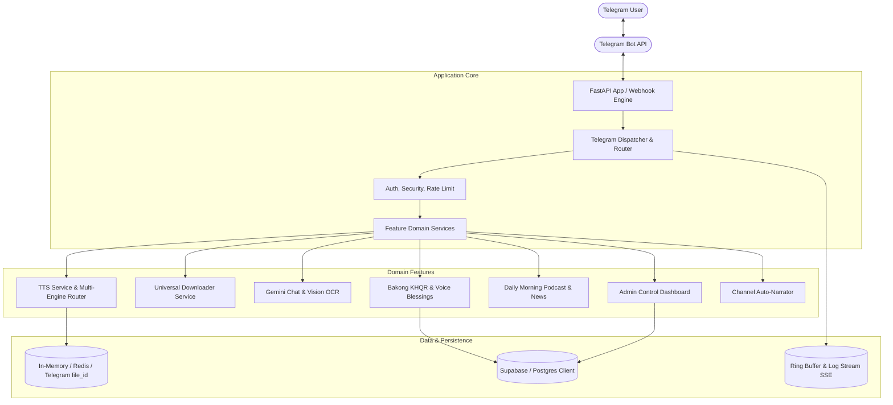

# Bot Voice Architecture Overview

## Overview
Bot Voice is a production-grade Telegram AI & Voice Assistant suite providing multilingual Text-to-Speech (Khmer, English, multilingual), video/audio downloading (TikTok, Facebook, Instagram, YouTube), Gemini AI OCR & vision reasoning, news & morning podcasts, and NBC Bakong KHQR automated donations.

## Directory Structure
- `app/config/`: Centralized settings (`settings.py`) and logging setup (`logging.py`).
- `app/api/`: FastAPI routes (`health.py`, `logs.py`, `tts.py`, `webhook.py`).
- `app/bot/`: Telegram bot runtime, dispatcher, filters, middlewares, keyboards, and callbacks.
- `app/features/`: Isolated domain features (`tts`, `downloader`, `ai`, `ocr`, `podcast`, `donation`, `admin`, `channel`).
- `app/core/`: Cross-cutting technical concerns (`security`, `telemetry`, `concurrency`, `lifecycle`).
- `app/database/`: Database client, models, batcher, and domain repositories (`users`, `requests`, `donations`, `settings`).
- `app/cache/`: Multi-tier caching (`memory`, `redis`, `audio`, `telegram`).
- `app/utils/`: Pure utilities (`text`, `language`, `files`, `media`, `retry`).
- `scripts/`: Operational tools (`migrate.py`, `backup.py`, `restore.py`, `seed.py`, `maintenance.py`).
- `docker/` & `deploy/`: Production containerization and Systemd automation.
